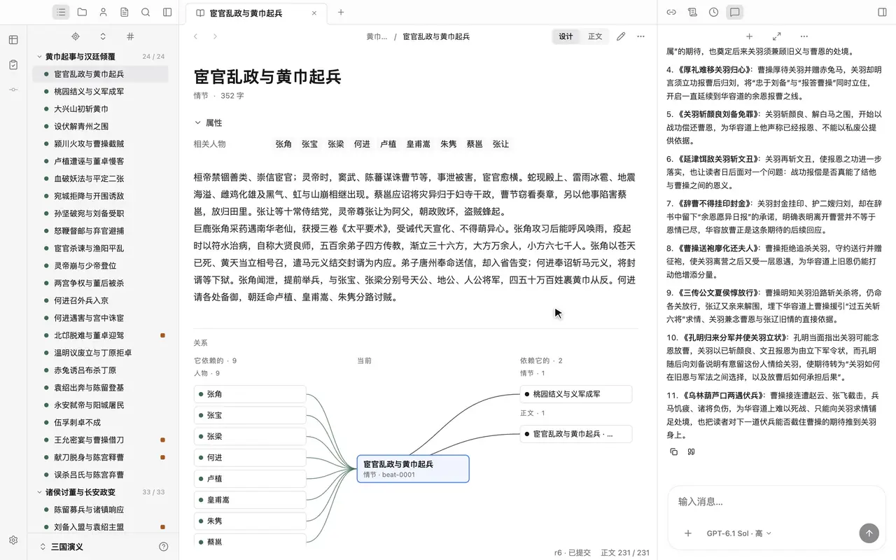
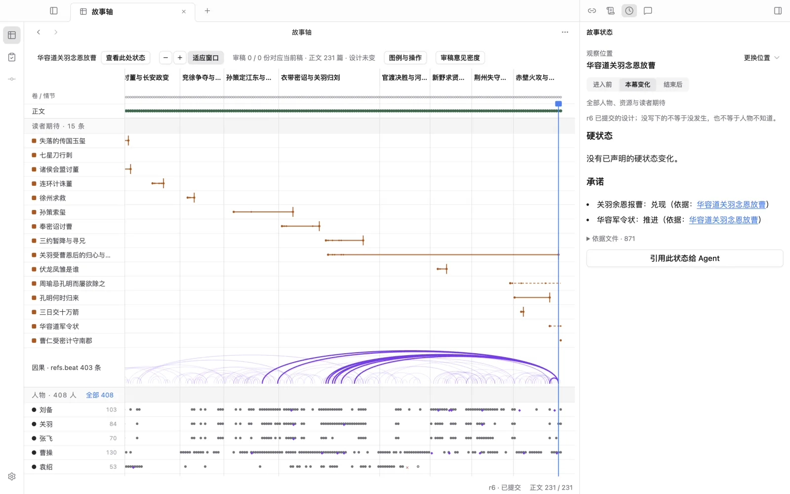
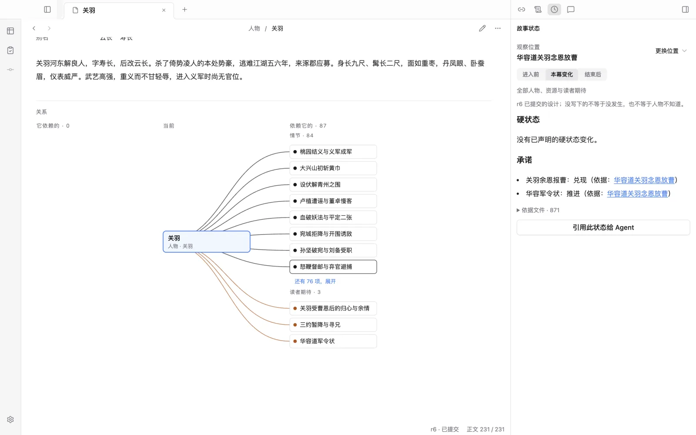
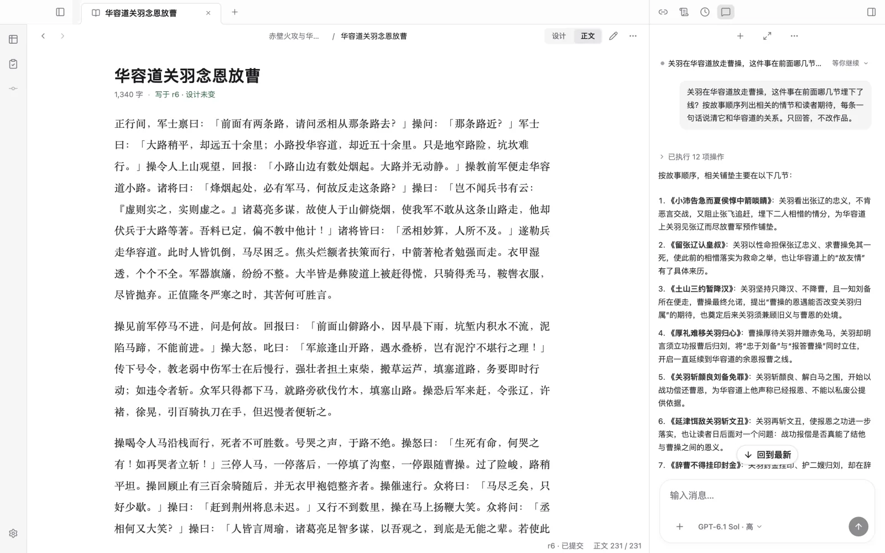

# 燧明界 Suiming

[](https://github.com/huangzhibo/suiming/actions/workflows/ci.yml)

开源的 AI 长篇小说工作台。它把整部小说写成一套能检查的结构（Story Language），用一条故事轴把整本书铺开，让 Agent 在这套结构上持续推进；你随时阅读、修改、插手。

<!-- 这一段只在阶段变化时改。 -->
> **当前状态：开发预览。**桌面工作台与自主 Agent 已经贯通，但证据最高只到「真实调用」：还没有一部完整的长篇在它上面写完，也没有安装包，目前只在 macOS 上验证过。完成度与已知缺陷见[当前状态](docs/current-status.md)，接下来做什么见[路线图](docs/roadmap.md)第 6 节。

<p align="center"></p>
<p align="center"><sub>示例作品是《三国演义》第一回到第五十回：设计由 Suiming 的 Agent 从原著忠实抽取，正文是原著原文。就是仓库里的 <a href="examples/README.md">examples/sanguo</a>，不配模型也能打开。</sub></p>

## AI 写长篇，难在长程一致性

长程一致性，是隔了几十上百章，前面立下的事实后面依然成立：死了的人不再出来说话，烧掉的东西不再回到谁手里，秘密揭开之前没人知道，埋下的伏笔有回应。守不住，连载读者就说作者「吃书」。整本书塞不进模型的上下文，靠它自己记，篇幅越长越守不住。

燧明界的做法是：能用规则管住的事实，不交给模型去记。作品写成结构，确定的事实由规则核对，文学上的判断交给模型、独立审稿和你。

## Story Language：把小说写成结构

Story Language 是燧明界定义的开放格式，规定每一种故事事实写在哪个文件、用什么形状写。核心是每一节（StoryBeat）一份因果设计：

```markdown
---
title: 华容道关羽念恩放曹
refs:
  character: [曹操, 张辽, 许褚, 徐晃, 程昱, 关羽]
  place: [华容道]
  secret: [华容放曹之意]
  beat: [beat-0133, beat-0201, beat-0223, …]   # 依赖前面哪几节
contracts:
  resolve: [关羽余恩报曹]                       # 在这一节兑现的读者期待
  advance: [华容军令状]
---
……程昱以关羽傲上不忍下、重恩怨信义，劝曹操亲以旧恩求放。曹操欠身问候求念旧，关羽先说斩颜良、
文丑解白马已经报恩，不能以私废公。……关羽忆曹恩及过关情，见曹军欲哭又不忍，勒马回头令军四散，实是放路。……
```

<sub>示例作品 <a href="examples/README.md">examples/sanguo</a> 里的一节，有删节。</sub>

- **开头几行是确定的事实。**这一节牵着哪些人物、地点、物品与世界设定，依赖前面哪几节，在哪条读者期待上埋下、推进或兑现；谁拿到了什么、谁死了、哪个秘密对谁揭开，也写在这里。规则能逐条核对。
- **下面是自然语言的因果。**为什么发生，人物凭什么处境和认知作出什么选择，付出什么，之后变成什么样。正文从这份设计写出来，重写正文时设计不变：StoryBeat 保证因果完整，正文保证阅读体验。
- **其余各有归处。**人物、地点、关键物品、世界设定各一个文件；需要跨多节回应的读者期待（StoryContract）单独成文件；你当前仍然有效的创作要求写在 `intent/`。

**规则管得住的，交给规则。**Checker 只核对确定的东西：格式、引用、顺序、硬状态（谁持有什么、谁已死去、哪个秘密何时揭开），这些不对就提交不了；读者期待到期没回应、秘密没埋下就揭开这类设计问题，检查标出来，但不拦阶段提交。文笔好坏、节奏快慢交给模型与独立审稿，不交给规则。

格式全文在 [story-language/](story-language/README.md)，是公开的：人、燧明界的 Agent、Codex / Claude Code / Grok 读同一份说明，改同一份文件。

## 一眼看全整本书

作品写成了结构，就能画出来。故事轴的横轴是全书的节，读者期待、因果依赖、人物的出场与死亡、秘密的揭示叠在同一条轴上；画的都是作品文件里写明的，不是模型临时推断的，点哪里都回到原文件。

**选中一节，看那一刻的世界。**故事轴上点一节，只留下与它有关的因果弧；右栏按进入前、本幕变化、结束后列出谁拿着什么、谁知道什么、哪条期待在这里兑现，每一条都能点回出处。



**人物牵着哪些情节。**人物页末尾是关系图：依赖他的情节、和他有关的读者期待，想看下一层再点一下。



## Agent 在上面推进，你随时插手

Agent 在你的作品目录上直接读、改、自检，可以把写正文、审稿交给子任务，阶段性提交多个版本；你可以随时打断、补充要求、直接编辑。Agent 被要求把你说过的长期要求写回作品的 `intent/`，不只留在聊天记录里；写没写回，每轮结束的对账看得出来。

**原文旁边就是 Agent。**问它「关羽在华容道放走曹操，前面埋了哪些线」，它按故事顺序列出 11 节，从小沛之战里关羽与张辽相惜，到乌林、葫芦口两遇伏兵。



```text
作者的目标 / 作品意图（intent/）
   ↓
Suiming Agent：在作品目录上读、改、自检，按需委派写作与独立审稿
   ↓
目录 diff → Checker → 原子提交
   ↓
作品的一个版本（同一个对话可以接着改）
```

一个任务交给 Agent，常常一跑就是一两个小时。Agent 的执行循环是燧明界自己写的，为改小说做了这几件事，都由程序保证、不靠模型自觉：

- **改动先过检查。**Agent 和它派出的子任务改的是同一份文件，过了 Checker 才成为一个版本；子任务不能自己提交。
- **停下了能接着做。**退出应用、进程崩溃、断网之后从原处继续；做到一半、结果说不准的动作停下来等你确认，不盲目重做。
- **原地打转会被拦下。**同一个动作得到同一个结果连续三次就停；一轮的用量到了上限先停下，说一句「继续」再接着做，上限在设置里可调。
- **每轮结束对一次账。**你发了几条消息、意图改没改、设计和正文各改了几个文件、提交了几个版本，由系统从文件差异算出来，不靠 Agent 自报。

写得好不好，还要你和独立审稿来看。

## 作品就是一个文件夹

大纲、人物、世界设定、正文、审稿都是 Markdown 文件；作品目录本身是 git 仓库，历史随它走，随时比较、回退。人、燧明界的 Agent、外部 coding agent 改的是同一份文件，换工具也带得走，不锁在任何服务里。

```text
my-book/
  intent/                  作者意图：当前仍然有效的创作要求
  outline/story/index.yaml 卷与节的顺序
  outline/story/vol-0001/  每一节（StoryBeat）的完整因果设计
  outline/contracts/       需要跨多节回应的长期期待
  world/                   世界设定；characters/、places/、resources/ 是人物、地点与物品
  text/                    正文，一节一个文件
  review/                  独立审稿
  reference/style/         作者选定的样章
  source/                  导入的原作材料与忠实抽取（改编时用）
```

最小的完整例子是测试样例里的苦肉计与火烧赤壁（[`packages/runtime/test/sample-work.ts`](packages/runtime/test/sample-work.ts)）；完整规模的例子是 [`examples/sanguo`](examples/README.md)，《三国演义》前五十回，9 卷 231 节。

## 快速开始

需要 Node.js 24 以上与 git。桌面端目前只在 macOS 上验证过，其他平台未验证。

### 桌面工作台

```sh
npm install
npm run dev:desktop
```

打开一个已有作品，或选一个空目录新建。想先看看一部长篇在里面是什么样，打开示例作品：打开作品时会在目录里建 git 仓库，所以先复制到仓库外，再点「打开作品」选复制出来的目录。

```bash
cp -R examples/sanguo ~/Documents/sanguo
```

阅读与编辑不需要模型；要和 Agent 对话，在导航轨底部的「设置」里配置：「提供商」里填 API key 或登录，「模型配置」里给各个角色选模型。目前是开发构建，安装包、签名与自动升级还没做。

### 命令行 `suim`

```sh
npm install
npm run build
npm link -w @suiming/cli
suim --version
```

```sh
suim init ~/stories/my-book --intent-file intent.md   # 新建作品，intent.md 是你的创作意图
cd ~/stories/my-book
suim session send "先读意图，设计第一卷的大纲，检查后提交"
suim status        # 作品状态：未提交的修改、过时的正文与审稿
suim check         # 跑 Checker
suim history       # 版本历史；suim rollback <revision> 恢复成一个新版本
```

不带子命令运行 `suim` 显示全部命令；命令的输出始终是带版本的 JSON 信封，给程序用也稳定，`--json` 只为兼容保留。

### 在 Codex / Claude Code / Grok 里写

```sh
suim init ~/stories/my-book --intent-file intent.md --agent claude-code
```

`--agent`（可重复，`codex` / `claude-code` / `grok`）会在作品目录里装上对应 host 的 Skill 与入口说明，之后用那个 host 打开目录、用自然语言提要求即可；host 用它自己的模型与凭据，经 `suim check` / `suim commit` 提交。已有作品用 `suim update --agent <host>` 补装或刷新。细节见 [integrations](integrations/README.md)。

## 模型配置

模型调用基于 [pi-ai](https://www.npmjs.com/package/@earendil-works/pi-ai)，可以用它支持的各家提供商。不同角色可以用不同模型，比如 `main`（对话的根 Agent）、`writer`、`reviewer`、`judge`（盲读评委，最好与 writer 用不同模型）；除 `main` 外都可以省略，省略时用 `main`。

配置在 `~/.suiming/config.toml`，桌面「设置」改的也是这份文件：

```toml
version = 1

[models.profiles.main]
provider = "deepseek"
model = "deepseek-flash"
```

全部角色与完整形状见[技术栈](docs/technology.md)「本地配置与凭据」。凭据存在 `~/.suiming/auth.json`，经桌面设置或提供商自己的登录流程写入；开发时也可以用 [`.env.example`](.env.example) 里的 `SUIMING_*` 变量覆盖。

部分提供商支持用订阅账号登录。各家对第三方应用使用订阅登录的条款不同，以提供商的条款为准。产品只使用你自己的系统代理与环境变量里的代理设置，不内置任何代理。

## 参与开发

规范真源是 [AGENTS.md](AGENTS.md)：产品目标、核心不变量、工程边界与开发约定（命令、检查脚本、提交与测试纪律）都在那里，人和 coding agent 共用；只在某个目录用得上的约定写在那个目录的 AGENTS.md。动手之前先读。Codex、Grok 直接读 AGENTS.md，Claude Code 从 2.1.277 起也直接读，本仓没有 CLAUDE.md。

```sh
npm run check          # 文档链接、生成文件对账、biome、类型检查
npm test               # 单元与集成测试；需要真实数据库、对象存储或双进程的用例默认跳过
npm run test:desktop   # 构建桌面端并跑真实 Electron E2E
npm run format         # biome 自动格式化
```

- workspace 包互相引用的是 `dist`：改了 `packages/*` 之后先 `npm run check` 或 `npm run build`，再 `npm test`。
- 生成文件不要手改：故事宪法、Story Language 文档与 host 接入文件各有 `npm run generate:*`，`check` 会核对。
- 修缺陷先写能复现它的测试；不靠弱化断言、跳过或吞掉错误让测试变绿。
- 提交信息用 `type(scope): 中文摘要`，正文写为什么。文档与代码注释用中文。
- 开源前的开发历史压成了一个基线提交（`chore: 开源基线（MIT）`）；文档里 2026-10-03 及之前的提交号指那段历史，在本仓里查不到（见 AGENTS.md）。

Cloud（PostgreSQL / S3 上的作品存储与显式同步）目前冻结：`npm run dev:api` 能起开发进程，配置见 [`.env.example`](.env.example)，但不在当前开发重点内。

## 文档

各文档管什么、按什么顺序读，见 AGENTS.md「真源与阅读顺序」。常用入口：

- [需求与目标](docs/vision-and-requirements.md)、[故事创作宪法](strategies/story-constitution.md)
- [Story Language](story-language/README.md)：作品的语义与目录格式
- [系统架构](docs/architecture.md)、[Harness 设计](docs/harness-design.md)：执行模型、恢复与故障验收
- [作者工作台设计](docs/workbench-design.md)、[可视化设计](docs/visualization-design.md)
- [技术栈](docs/technology.md)
- [当前状态](docs/current-status.md)、[实施路线图](docs/roadmap.md)
- [ADR](docs/adr/README.md)：历史决策，不是现行规范

## 代码结构

```text
apps/
  desktop/   Electron 主进程：持有 Runtime 与凭据
  workbench/ React 作者工作台，经 typed IPC 接入桌面
  cli/       suim 命令行与给程序用的 JSON 契约
  api/       Cloud Domain API（冻结）

packages/
  story/     Story Language、Story Core、Checker（不依赖网络、数据库与模型）
  runtime/   作品存储、SuimingHarness（Agent loop 与恢复）、事件、模型网关、本地服务
  sdk/       命令目录、领域 schema 与事件信封
  cloud-postgres/  Cloud 的 PostgreSQL 存储
  cloud-s3/        Cloud 的 S3 兼容对象存储

integrations/  Codex / Claude Code / Grok 的薄接入（Skill 与入口说明）
story-language/  Story Language 文档（生成进 packages/story）
strategies/      故事创作宪法
```

## 许可证

[MIT](LICENSE)。Story Language 与测试里的故事示例取自《三国演义》，属于公有领域。
