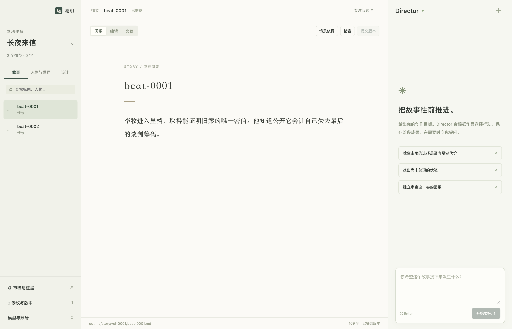
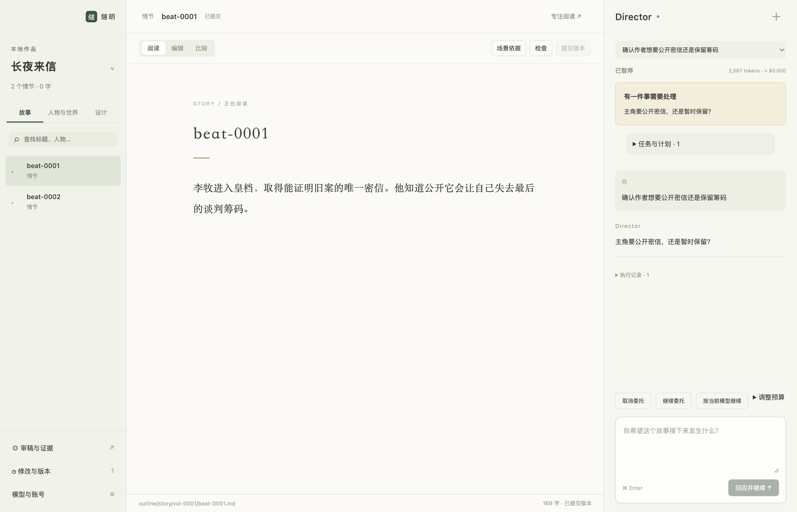
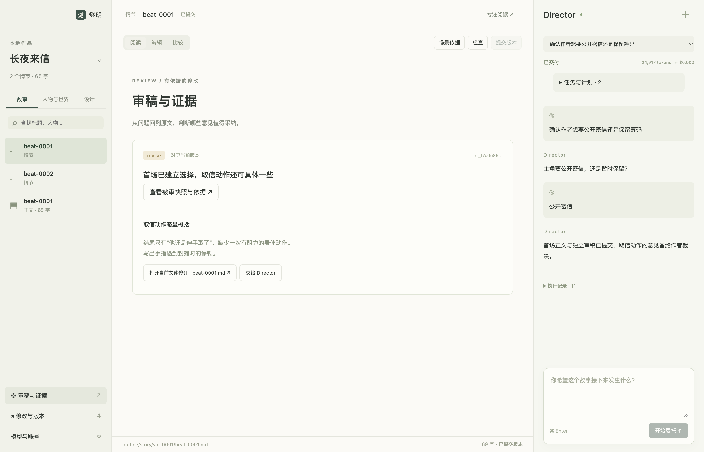

# 桌面 UI / UX 与可视化重审

状态：2026-09-08 的设计审查与讨论稿，已被取代，不再维护。第 14 节确认的「窄导航轨＋上下文栏」被当晚落地的 v7 布局取代，第 2 节的六模块导航从未实现；第 3、6 节的事实边界已并入[可视化设计](../visualization-design.md) 1.1–1.2，第 4 节 48 个视角里数据就绪的部分收敛成了同文的故事轴与邻域图。文中的委托、Run / Task / Attempt、预算、ContextSnapshot、DesignCommit 都是当时的概念，现已删除。现行规则见[作者工作台设计](../web-product-design.md)与[可视化设计](../visualization-design.md)。

目标是帮助作者理解、判断和改变故事。当前实现已验证执行和版本链路，但没有形成与长篇创作相称的信息架构。分栏、配色和组件库只是表达手段；可视化的验收对象是作者完成了什么判断、依据是否准确、修改是否可控。

## 1. 当前界面的证据

本轮重新启动真实 Electron，在隔离的两 Beat 样例作品上操作三个步骤。委托使用仓库 faux provider，没有发出真实模型请求，没有修改作者的实际作品。截图均为本轮实际界面，已逐张检查；该样例不能证明长篇规模下的可用性、性能或文学质量。

### 步骤 1：打开作品并查看情节——可操作，组织方式不足

- 正文区域稳定，阅读、编辑、比较以及保存状态可找到，这是可保留的基础。
- 导航和大标题主要显示 `beat-0001`，卷的组织没有呈现。当前样例未提供 Beat title，但 UI 仍需要友好的回退标题；ID 可以进入详情，不应占据作者的主阅读层。
- 情节设计使用了与正文相同的阅读页，没有呈现人物、前提、选择、代价、后续依赖和伏笔的结构入口。
- 右侧长期保留完整宽度与通用建议，当前选中的内容没有转化为具体可操作的创作建议。
- 大面积留白部分来自短样例，不能据此判断真实正文行宽；但上下文和结构信息缺席并非字数不足可以解释。
- 低强调文本较淡、多个控件字号小，存在可读性风险。截图不能证明对比度、VoiceOver 或中文输入完整合格。

### 步骤 2：Agent 等待作者选择——可回应，决策表达不足

- 问题可见，作者可以回应，原文没有被自动切走。
- 同一个问题同时出现在暂停提示和 transcript，但没有明确呈现两种选择影响哪些段落、涉及什么代价。
- “继续委托”“按当前模型继续”“调整预算”与真正需要回答的创作问题挤在同一区域。暂停原因需要映射成相应的主行动，故障恢复和模型设置应渐进展开。
- token 与金额比阶段成果更突出，执行状态尚未被转译为作者关心的“已经完成什么、还差什么”。

### 步骤 3：打开审稿报告——证据可达，修订空间不足

- 报告区分当前版本，能够打开被审快照和当前文本，也能交给 Agent。
- 中央已经进入 Review，顶部和底部仍沿用之前选中的情节标题、字数和文件信息，作用域容易混淆。
- 问题、被审原文、当前稿和修订结果需要切换才能比较；“读报告”与“处理问题”尚未形成连续工作区。
- `revise`、报告 ID 和文件名默认露出；对作者更有意义的是问题性质、位置、实际证据及意见是否仍适用。

本轮没有覆盖所有菜单、键盘路径、屏幕阅读器和长文压力；没有做可访问性合规声明。前三步的实际功能可用，不等于精细 UX 已完成。

## 2. 从空间布局转向作者工作模式

骨架保持简单：左侧窄导航轨与上下文栏、中央主工作面、可收起的辅助面。没有跨全窗的作品标题栏，也不建设任意拖放的通用桌面布局框架。统一导航规则见[作者工作台设计](../web-product-design.md)第 3 节。

Agent 的位置随任务变化：构思和讨论时可以占据主工作面；读写时在辅助面连续保留；结构分析时可收起为状态入口。作者显式切换布局，AI 的回复、完成或失败都不能抢走主工作面。

| 工作模式 | 中央主工作面 | 辅助面 | 默认主行动 |
| --- | --- | --- | --- |
| 构思与委托 | 自然语言讨论、目标、候选方向与阶段交付 | 固定的相关原文或候选预览 | 表达目标、比较方向、回应问题 |
| 阅读与修订 | 连续正文，按需显示边注和修订 | Agent 或选中对象的依据 | 选段、改写、保存、核对版本 |
| 结构推演 | 大纲、泳道、局部因果、Contract 或知情矩阵 | 所选节点的原文、状态与解释 | 定位断点、比较时点、提出修改 |
| 审稿处理 | 问题列表与被审原文并置，必要时对照当前稿 | 证据、理由、修订建议 | 判断意见、修订、复核 |
| 版本比较 | 前后版本或三方冲突比较 | 改动摘要、影响、相关审稿 | 确认合并、恢复为新版本 |

辅助面在 Agent 和对象详情之间切换时保持各自状态。需要持续对照时，可把依据固定在中央的分屏里；不要求四个窄栏永久同时出现。

已确认的主导航收敛为：创作、正文、故事结构、人物与世界、材料、审稿与版本。创作与正文分开，避免委托列表与作品目录在上下文栏里另建模式切换。各类表示放在主工作面的视图操作区；Library 从作品切换器进入，模型与账号仍在应用设置中，设置沿用相同导航规则。以下 48 个视角不是 48 个一级菜单，也不是同时建设的页面清单。

## 3. 视图共同遵守的上下文与事实边界

先区分六种观察立场：作者看全局事实与创作意图，读者看截至当前位置已经披露的内容，人物看自己的经历与认知，结构视角看因果与组织，创作协作视角看委托与选择，证据视角看版本与判断依据。它们是同一作者工具中的观察方式，不是六种用户角色或权限，也不新增独立 Reader 产品。

每个可视化都明确当前作品、对象或选区、阅读范围和版本。涉及时点的视图还需标出“进入这个 Beat 前”或“这个 Beat 后”，并区分叙述顺序、故事世界时间和运行时间。只有相关视图显示相应控件，不增加新的全宽参数栏。

数据分为三类：

- **确定性投影**：作品中记录的顺序、引用、硬状态、Contract 锚点、版本与实际输入证据。准确表达“记录了什么”，不自动证明文学质量或完整世界真相。
- **语义解释**：人物动机、情感关系、读者期待、节奏、未显式陈述的因果。由模型结合原文分析，必须标注来源、适用版本、不确定性和反例；不能画成测量事实。
- **创作候选**：尚未采用的方向、局部修订或反事实推演。与当前稿视觉区分，采用时走已有作品修改和提交能力。

视图状态、分析缓存和图布局都可删除。作者采用的长期结论写回相应 Intent、Character、World、StoryBeat 或其它既有 artifact；不新增与它们平行的知识图谱 Canon。不能为了画图强迫每个 Beat 填满情绪、时间、地点和关系字段。

## 4. 48 个作者视角

### A. 创作与正文

| 编号与视角 | 作者要回答的问题 | 可视化元素与交互 | 数据边界 |
| --- | --- | --- | --- |
| A1 创作工作面 | 这次要解决什么，Agent 已经交付什么？ | 目标摘要、连续讨论、阶段交付卡、可固定作品预览；点交付打开对应版本 | 对话、Run、revision；普通聊天不成为作品事实 |
| A2 创作意图 | 我希望人物和读者获得什么体验，哪些要求不能丢？ | 按作品/人物/片段分组的意图清单、原文引述、冲突提示、当前委托引用 | Intent 原文为准；冲突判断是语义解释 |
| A3 连续阅读 | 故事连起来是否自然，我读到哪里？ | 连续正文、卷与章节定位、阅读位置、可开关的标注层、专注模式 | Beat 顺序来自 index；发布章节来自 Release，不能把 Beat 直接当章节 |
| A4 写作与局部修订 | 这段如何改变，改动是否保存？ | 选区工具条、行内增删、边注、保存状态、撤销；源文件模式作为深入入口 | 保存、候选、已提交分别表达；外部修改不覆盖 buffer |
| A5 Design 与正文对照 | 这段设计在正文中怎样实现，正文新增了什么？ | 两列同步阅读、Beat 级对应、引用高亮、回写 Design 的修改入口 | Beat 对应与 lineage 可确定；逐句语义对齐需分析，未对齐时明确说明 |
| A6 候选方向与版本比较 | 两种写法或故事方向各有什么代价？ | 并排文本、变化摘要、影响提示、作者选择与理由 | 使用既有候选/版本；反事实为提案，不承诺预测正确或预建分支引擎 |

### B. 故事结构与读者体验

| 编号与视角 | 作者要回答的问题 | 可视化元素与交互 | 数据边界 |
| --- | --- | --- | --- |
| B1 全书结构 | 全书怎样组织，哪一段还缺正文或复核？ | 卷 → Beat 大纲、紧凑列表、独立状态列、范围缩略条 | 顺序按 index；正文覆盖、Design lineage、Review 有效性分别计算 |
| B2 情节卡片 | 每个故事单元发生了什么变化，顺序是否合适？ | 索引卡、短摘要、角色/结果标记、拖动候选顺序与影响预览 | 摘要可从原文派生；重排改变作品，必须经命令与 Checker，不能仅改画布 |
| B3 多线交织 | 主线、人物线与副线在哪里交汇、消失或抢占篇幅？ | 按线索分组的泳道、交汇锚点、区间筛选、展开相应正文 | 分组是作者选择或带依据的分析；refs 不直接等于出场或 POV |
| B4 局部因果 | 后果依赖什么选择，哪一环缺乏支撑？ | 按叙述顺序布置的局部有向图、前因/后果邻域、边上的解释与引文 | 显式 Beat 依赖与 AI 因果解释分层；相邻或同现不能自动连因果边 |
| B5 叙述与世界时间 | 倒叙、插叙和同步事件有没有混乱？ | 叙述顺序/世界时间双轨、相对时间区间、映射连线、未知区段 | index 只给叙述顺序；未写明的日期与时长保持未知，不强造日历 |
| B6 阅读节奏与体验 | 压力、行动、对白、停顿和回响如何分布？ | 字数/段落等实测分布、带引文的体验色带、可并排对照的区间 | 统计和 AI 判断分开；不制造“爽感 87 分”或无来源的情绪曲线 |

### C. 人物、关系与知情

| 编号与视角 | 作者要回答的问题 | 可视化元素与交互 | 数据边界 |
| --- | --- | --- | --- |
| C1 人物全貌 | 这个人是谁，哪些经历值得重读？ | 人物列表、处境与矛盾摘要、相关 Beat、实际原文入口 | Character 是轨迹基底；当下形象来自有界经历，不把未来传记倒填基底 |
| C2 人物变化 | 哪些压力、选择和代价改变了这个人？ | 轨迹带、关键选择锚点、前后对照、变化解释 | 时序和引用可派生；欲望与心理变化是有证据的语义解释 |
| C3 人物关系 | 两人的利益、信任、冲突和认知在哪里变化？ | 默认以选中人物为中心的局部关系图、时点滑块、关系变化记录 | 区分客观关系、人物相信的关系和 AI 解读；无事实依据不画关系强度 |
| C4 家族与身份 | 血缘、礼法名分和身份揭示是否一致？ | 家族拓扑、身份/别名标记、隐藏信息图层、关联揭示点 | 初始 family 可确定；后续变更从 Beat 核对，不从称谓臆造关系 |
| C5 人物知情 | 到这个位置，谁知道哪件事，谁误解了什么？ | 人物 × 秘密/事实矩阵、Beat 游标、已知/未知/有争议标记、传播依据 | 硬状态只覆盖少量记录；未记录不是“不知道”，误信与半知需要语义证据 |
| C6 真相与披露 | 世界真相、人物认知和读者获知是否错位？ | 世界/人物/读者三条披露轨道、时间错位连线、疑似提前泄露标记 | 作者能读到不代表人物或读者知道；读者模式只按明确披露范围展示 |

### D. 世界、资源与长期承诺

| 编号与视角 | 作者要回答的问题 | 可视化元素与交互 | 数据边界 |
| --- | --- | --- | --- |
| D1 世界规则与使用 | 哪条规则限制了当前选择，有没有临时造例外？ | 规则列表、限制/代价摘要、被引用位置、规则与场景并排阅读 | World 与显式 refs 为入口；语义适用性由分析解释 |
| D2 场所与行动范围 | 人物如何抵达、受什么空间条件限制？ | 场所列表、相对拓扑、人物轨迹；有准确数据时再显示地图 | 无坐标时不画精确地图；地点引用不证明人物曾到场 |
| D3 资源流转 | 密信、钥匙、资金或能力来源到了谁手里？ | 离散转移链、持有者泳道、消耗/毁坏节点、前后原文 | 仅对实际 identity 与已记录状态确定重放；普通物件无需全部登记 |
| D4 状态核对 | 此刻谁在哪里，什么已经消耗，哪个秘密已揭示？ | Beat 前后状态差分、变化日志、冲突定位、作用域切换 | 重用硬状态 IR；缺失值显示未知，不补默认 false |
| D5 长期承诺 | 伏笔或承诺何时建立、推进、回应，是否接近期限？ | Contract 跨 Beat 轨道、open/advance/resolve 锚点、期限标线、间隔提示 | 生命周期和期限可检查；resolve 不代表读者满意或语义充分兑现 |
| D6 线索、意象与回响 | 某个意象或暗示重复了几次，后文怎样重解释？ | 引文串联、出现区间、前后回响对照、局部线索图 | 普通线索不一律升级为 Contract；主题或呼应关系须显示解释依据 |

### E. 材料、参考与创作依据

| 编号与视角 | 作者要回答的问题 | 可视化元素与交互 | 数据边界 |
| --- | --- | --- | --- |
| E1 材料阅读 | 输入原文实际写了什么，抽取有没有改变它？ | 原文与提取结果并排、片段定位、材料版本、来源标记 | 原始输入、material 与 extraction 分开；不把 Target 意图写进 Source |
| E2 材料覆盖 | 哪些范围真的被读过、形成了结果，哪里有缺口？ | 按材料范围绘制的覆盖带、缺口、handoff 入口 | 依据 MaterialEvidence 与 Context；“被读取”不等于“被正确理解” |
| E3 Source 到 Target | 哪些来源被采用，哪些是改写和原创？ | Source/Target 对照、Commit lineage、已证实映射与待核实解释 | 现有 sourceCommitIds 是较粗的血缘；不能伪造逐句采用关系 |
| E4 风格与口吻参考 | 参考文本的哪些写法值得采用，当前段落是否体现？ | 参考引文、当前文本、表达意图三方对照；人物对白可作专项比较 | 参考不自动成为命令；口吻差异和风格相似属于语义判断 |
| E5 实际输入 | Agent 或 Reviewer 当时到底看到了什么？ | 按内容分组的 Context 清单、实际片段、版本、新旧状态、缺失提示 | 读取保存的 ContextSnapshot；不能把重新检索到的内容冒充当时输入 |
| E6 依据追溯 | 这条判断或这段稿子来自哪些版本、输入和审稿？ | 小范围证据链、对象详情、指向原始内容的稳定链接 | 只画实际记录的 lineage 与证据；不把“被读取”画成“被采用” |

### F. 审稿、版本与修改风险

| 编号与视角 | 作者要回答的问题 | 可视化元素与交互 | 数据边界 |
| --- | --- | --- | --- |
| F1 问题工作台 | 哪些问题值得先看，意见是否仍适用于当前稿？ | 按范围/严重程度分组的列表、问题摘要、当前/历史/未复核标记 | 保留 Review 的可反驳性；筛选与作者处理状态不能伪造新的 Review 结论 |
| F2 原文批注 | 这条意见针对哪里，修订后解决了吗？ | 精确原文高亮、边注、被审版本/当前版本对照、交给 Agent 的引用 | 锚点绑定版本；无法精确对应时显示原快照，不能猜到当前行 |
| F3 审稿覆盖 | 哪一卷、哪类内容实际有审查证据，哪些还没覆盖？ | 范围 × 已实际检查维度的矩阵、未覆盖与失效格、报告入口 | 按报告实际 scope 计算；一个文件被读取不证明所有维度都审过 |
| F4 修改历史 | 上次到现在发生了什么，为什么改变？ | revision 时间线、内容差分、结构/状态差分、阶段摘要 | 差分是事实，摘要是解释；恢复旧稿应形成新 revision |
| F5 修改影响 | 改动这个设定或选择后，哪些正文和判断需要重看？ | 局部影响图、受影响列表、显式依赖/证据失效/可能影响三类标记 | refs 不是全部影响；AI 扩展建议不等于确定影响，不默认重写所有下游 |
| F6 冲突合并 | 作者、Agent 或 host 的修改怎样兼容？ | 基线/本地/外部三方对照、冲突块、保留双方、合并预览 | 用现有 hash/base revision 核对；不会默默覆盖，也不让前端直接推进 Canon |

### G. 与 Agent 协作

| 编号与视角 | 作者要回答的问题 | 可视化元素与交互 | 数据边界 |
| --- | --- | --- | --- |
| G1 连续对话 | 我怎样自然地讨论、修正和推进目标？ | 文档式 transcript、选区引用、阶段成果、可展开 activity | 可主面也可辅助面；AI 回复不主动切走作者正在看的内容 |
| G2 创作决策 | 系统需要我决定什么，两种选择的后果是什么？ | 问题卡、可编辑选项、代价/影响说明、关联原文、自由回答 | 建议允许改写；未知后果标为推演，不把接受按钮变为强制配方 |
| G3 工作计划 | 当前准备做什么，为什么改变了安排？ | 简单清单、阶段分组；真实依赖复杂时展开局部 DAG | 显示实际计划；普通工具调用不升级为 Task，历史执行不因计划改写消失 |
| G4 委派与交接 | 谁在处理哪份工作，结果是否已交回并采用？ | 父子树、任务作用域、结果入口、交接与适用性标记 | 父子关系与 dependsOn 分开；只展示已有运行事实，host-native 不补画内部代理 |
| G5 预算与消耗 | 已花费多少，还能继续多久，需要调整什么？ | 调用/token/估算金额、预算边界、未知用量提示、任务明细 | 有明确上限才画消耗条；不把消耗比例当创作完成度，不虚构预计完成时间 |
| G6 暂停、恢复与后台状态 | 为什么停了，关窗口后怎样，下一步能做什么？ | 原因明确的状态条、对应主操作、已保存成果、恢复位置 | 作者问题、额度、网络未知与错误分开；停流不代表交付，退出进程后不会继续本地生成 |

### H. 作品管理与交付

| 编号与视角 | 作者要回答的问题 | 可视化元素与交互 | 数据边界 |
| --- | --- | --- | --- |
| H1 作品库 | 我要继续哪部作品，上次停在哪里？ | 最近作品、封面可选、目标/最近片段摘要、本地路径和关联状态 | 没有封面也可完整使用；不默认制造进度、评分或伪缩略图 |
| H2 作品近况 | 离开后发生了什么，现在最需要我处理什么？ | 可恢复工作位置、最近交付、待决策、实际未覆盖范围 | 简报由事实和解释组成并可展开原文，不成为单独维护的项目状态库 |
| H3 发布编排 | 发布章节怎样对应正文，是否有遗漏或重复？ | 章节目录、正文范围映射、分页/输出预览、发布边界状态 | Release 从 StoryText 派生；发布分章不反向切割 Beat |
| H4 导入、导出与同步 | 哪些内容将新增、替换或冲突，作品包是否完整？ | 变更清单、内容预览、冲突定位、可核对的传输结果 | 显式本地/Cloud 边界；Cloud 产品继续冻结，视角列入终局规划 |
| H5 模型与账号 | 哪种工作使用哪个模型，当前连接能否工作？ | profile 分组、连接状态、支持的认证入口、费用说明 | 凭据留主进程；未验收的 OAuth/订阅能力不显示为已支持 |
| H6 作者选择与质量验证 | 哪个候选更好，作者为什么选择它？ | 可选匿名并排阅读、选择理由、修订记录、相同输入预算说明 | 作者偏好与机器检查分开；正式 paired eval 不从一次点赞推导质量优越 |

## 5. 跨视角复用的可视化元素

| 元素 | 表达什么 | 必备交互与约束 |
| --- | --- | --- |
| 范围缩略条 | 全书中当前查看的位置、已选区间与定位点 | 缩放到卷/Beat，拖选范围；只显示实际存在的内容 |
| 时点游标 | 进入某 Beat 前或结束后的展示边界 | 带动人物、知情、资源与 Contract 视图同步；不得混淆世界日期 |
| 大纲树与紧凑表格 | 层级、顺序、筛选和对比 | 键盘导航、列选择、虚拟化、返回原位置 |
| 情节索引卡 | 一次变化的摘要与相关对象 | 展开原文、选中联动、候选重排；不成为强制流程卡 |
| 泳道与轨道 | 多条故事线、人物轨迹或长期承诺的交织 | 共享范围与游标，折叠无关线；类别来自明确分组 |
| 局部关系节点与边 | 关系、依赖、因果或证据连接 | 每种图标明边的含义、方向、来源；默认局部，不混成全书毛线团 |
| 矩阵单元格 | 人物知情、覆盖、范围差异 | 每格可回到来源；未知、未覆盖、过期和否定分别显示 |
| 前后状态差分 | 一个 Beat 或 revision 实际改变的状态 | 显示旧值、新值、作用域和产生变化的位置 |
| 原文锚点与引文 | 解释、批注和决策的依据 | 悬停预览、点击固定、返回原位、准确版本，提供非悬停替代入口 |
| 版本与适用性标记 | 当前、历史、候选、未保存、需复核 | 文字与图形联合表达；保存状态和质量状态分开 |
| 行内修订与三方对照 | 文字、结构和冲突变化 | 保留双方、选择合并、撤销、查看基线；不能静默接受 |
| 阶段成果卡 | 已交付的作品结果及涉及范围 | 点开正文、差分或 Review；默认不展示整段工具参数 |
| 作者决策卡 | 需要人选择的方向与代价 | 可编辑选项和自由回答，问题解决后保留历史 |
| 任务树与局部 DAG | 分工、执行依赖、结果交接 | 区分父子和依赖；图是执行状态视图，不是另一个引擎 |
| 覆盖带与预算条 | 实际范围覆盖、已知上限内的消耗 | 标出分母与未知部分；不能转译为总体质量分或完成百分比 |
| 搜索结果与定位高亮 | 符合作者表达意图的候选原文 | 显示命中原因、版本、范围；搜索入口不要求用户知道文件名 |
| 全图概览与图例 | 当前位置、筛选条件、节点与边的含义 | 图变复杂才出现；缩放保持稳定布局与可读标签 |
| 空、未知、过期和失败状态 | 当前缺少什么，下一步有什么选择 | 用不同的说明和操作，不能用同一种灰色填补所有空白 |

同一内容在图、表、正文、对话间切换时保持选中对象、版本和时点。检索、过滤、改图布局是视图操作；重排、改关系事实、采用候选和合并才是作品操作，走同一领域能力。

## 6. 六种不能混用的图语义

1. 故事因果图：选择和后果之间的故事关系；显式引用与解释分别标记。
2. 人物/世界关系图：人物、家族、场所、资源之间的特定关系；可随时点变化，不等同于共同出现。
3. 知情与披露视图：世界、人物、读者之间的信息边界，优先用矩阵和轨道。
4. 作品影响与证据图：revision、Artifact、Context、Review 和可能受影响范围的联系。
5. Task 依赖图：实际工作需要哪些结果先完成。
6. 委派与交接树：谁发起了什么任务、结果交给谁；与 Task 依赖不同。

它们可以互相定位，但不能因为都能画节点和边就共用一套业务含义。UI 使用图形表示不要求引入 LangGraph、预规划执行图或第二份运行真源。

## 7. 视觉语言与精细交互

- 保留温暖纸色和克制的绿色，但用中性色保证正文与辅助信息可读。颜色优先表达选中、提醒和状态；人物/故事线需要分类颜色时使用独立图例，不能让某个角色颜色看起来像错误状态。
- 工具栏紧凑，正文舒展，分析表格高密度。按内容选择排版，不把所有 artifact 套成大标题加 Markdown，也不把所有分析套成卡片。
- 界面字体与正文宋体分开。字号、行高、间距、圆角和边框用有限的 token 体系，分别验收长中文标题、200% 缩放和低对比环境；具体数值待有真实内容的视觉稿验证。
- 节点和卡片应使用人能理解的标题。无标题 Beat 用明确标记的内容预览或可编辑标题建议；ID、hash、provider 参数和 Context 编号进入详情，不成为主导航语言。
- 悬停仅提供快捷预览；点击、键盘和屏幕阅读器应有等价路径。图可切换成表格，拖拽提供移动前/后的命令替代。
- 阅读位置、图布局、筛选与展开状态保持稳定。新事件只更新相关区域，不重新排整张图、不跳滚动、不自动切换模式。
- 在较窄窗口优先保留主任务，辅助面按需覆盖或收起；对照任务采用明确的切换或上下排列，不能把所有栏无限压窄。
- 过期分析保留原版本的解释入口；切到新稿时说明哪些依据变化，不能继续显示为“当前事实”。

shadcn/ui 可承担按钮、表单、弹窗、菜单、分栏和无障碍交互底座。人物时点、Contract、知情矩阵、影响图、证据定位和长篇阅读仍需要 Suiming 自己的领域视图；组件库的引入不能作为 UX 完成的标志。

## 8. 当前基础与实现顺序

| 当前基础 | 已有内容 | 还需要什么 |
| --- | --- | --- |
| 作品与状态 | StoryBeat 顺序、refs、family、硬状态、Contract 生命周期 | 面向作者的结构化查询与图/表投影；目前不能从文本 Context 假装已有完整图 API |
| 版本与证据 | DesignCommit、StoryText lineage、ContextSnapshot、Review、revision | 精确 UI 锚点、范围差分、语义解释与来源联动 |
| 持久委托 | Run/Task/Attempt、计划、交接、预算、事件 | 成果优先的展示、问题类型分流、独立对话与详情工作面 |
| 桌面工作台 | 单文件读写、diff、Review、文本 Context、Agent、模型设置 | 连续正文、模式布局、作用域一致性、图/矩阵和大规模数据体验 |

优先级按作者闭环安排：

1. **先完成精细的工作台基础**：友好标题、卷与 Beat 层级、连续读写、选区与证据定位、模式布局、清楚的版本/范围、设置与恢复文案。用真实内容完成完整交互设计后再实现。
2. **首批故事可视化**：局部因果、人物轨迹、知情/披露、Contract 轨道、修改影响。它们直接承接本产品已有领域优势；同批打通审稿问题与原文对照。
3. **长篇深入视角**：多线泳道、家族与复杂关系、资源流转、材料血缘、发布映射。按真实作品中的问题逐步落地。
4. **按证据决定是否扩展**：情绪/节奏分析、复杂地图、完整图总览或形式化盲评工作区。先证明比原文、列表或局部图更能帮助判断；没有数据或没有任务收益时不建设。

完整产品需要相应能力，不要求所有视角都是独立页面。当前不新增通用 graph engine、图数据库、关系 Canon、强制字段表或另一个 Agent runtime。

## 9. 按作者任务验收

下一轮设计与原型至少用以下六个任务检查：

1. 从上次阅读位置继续，选中一段提出修订，比较并保存；全过程不丢输入和原阅读位置。
2. 定位一个人物在某 Beat 前为什么作出选择，打开实际经历，并分清确定状态和模型解释。
3. 发现读者或人物提前知道秘密，定位披露路径和受影响文本；没有记录时如实显示未知。
4. 找到某个长期承诺的建立、推进、回应及当前期限，核对“结构闭合”和“语义兑现”的区别。
5. 修改密信的持有者或结局代价，查看显式依赖、可能受影响部分和失效 Review，保留无关正文。
6. 在一个当前/历史 Review 问题上对照原文与新稿，决定修订或保留，回到原工作位置。

先以真实 3 卷 30 Beat 创作验收；较大数据集另测列表/图/文本性能，明确区分合成压力样例和真实质量证据。记录找依据所需步骤、完成时间、误操作、无法解释的图形与被迫切换次数；不以截图漂亮、节点数量多或模型自评分作为通过标准。

## 10. 参考与采用的启发

Scrivener 用同一稿件的 Binder、Corkboard、Outliner 与连续阅读表达不同工作视角，启发是“同一内容、多种表示”，而不是增加更多作品真源。[官方产品说明](https://www.literatureandlatte.com/scrivener/overview)

Aeon Timeline 明确区分故事世界中的 chronological order 与读者看到的 narrative order，也允许没有日期时先组织故事。这支持我们把叙述顺序、客观发生和披露边界分开，并保留未知信息。[官方创作指南](https://www.aeontimeline.com/getting-started/planning-fiction-from-scratch)

上面两点是设计参考。本文的 48 个视角和模式布局是针对 Suiming 领域与实际界面的方案，尚待作者使用和原型验收。

## 11. 工作台视觉探索与共享交互

2026-09-08，作者认可采用 shadcn/ui 作为基础控件与交互底座，进入视觉方案比较。本节仍是设计稿；组件尚未接入，图中新增的领域视图不代表已经实现。

三种方向共用《长夜来信》的两 Beat 样例，以“让李牧的主动选择与不可恢复的代价成立”为同一创作问题。`皇档取信`、`焚信作证` 是供视觉稿使用的标题建议，不表示样例已新增标题字段或发布章节。图中的候选修订也没有写入作品。

| 方向 | 主工作面 | 辅助信息 | 关键行动 |
| --- | --- | --- | --- |
| 文稿与边注 | 原文、选区与原位审稿标注 | 当前意见、后续情节与承诺入口 | 针对选段请求修订 |
| 故事透镜 | 两 Beat 的局部依赖与承诺轨道 | 选中节点的设计、正文与解释来源 | 从结构疑问回到原文修订 |
| 创作与证据并置 | Agent 的目标、建议与阶段交付 | 被修改原文、建议稿与相关约束 | 比较并将建议写入当前稿 |

这些方向用于选择默认工作重心；终局仍支持前文的不同工作模式。不能让选中的单张图取代六项作者任务验收。

视觉稿按本轮对话中实际展示顺序编号：

- [第 1 张：文稿与边注](../design/2026-09-08-workbench-concepts/01-manuscript-and-margins.png)
- [第 2 张：故事透镜](../design/2026-09-08-workbench-concepts/02-story-lens.png)
- [第 3 张：创作与证据并置](../design/2026-09-08-workbench-concepts/03-agent-and-evidence.png)

三张均为 Image Gen 独立生成的静态探索，以第 1 节的真实界面截图为参考；目标视口为 1440 × 1024，实际图片为 1487 × 1058。当前尚未选择实现目标。它们支持讨论布局、层级和主行动，不证明组件可运行、文字像素精确或交互已通过验收。实现时需统一品牌字形和字体 token、图节点与导航选中状态，并按共享交互契约核对焦点、版本与候选状态。

### 共享交互契约

1. **选区与依据**：原文选区、边注与报告双向定位。报告依据绑定被审版本；当前稿变化时显示“依据来自旧稿”，无法准确重定位就打开原快照，不把近似匹配画成精确证据。
2. **定向修订**：从选区发起时，把选段、所在 Beat、版本和作者补充意图作为可见上下文。正文选择不是修改授权的无限扩大；跨情节改动应在候选交付中清楚列出。
3. **候选采用**：“建议稿 / 未采用”与当前稿分开；采用后成为当前稿修改，随后通过已有保存、检查与提交路径进入作品版本。按钮明确表达“采用到当前稿”，不让“采用建议”暗含版本提交。
4. **冲突保护**：候选生成期间原文被作者或 host 修改，采用前比较基准；无法直接应用时进入对照，不覆盖新稿。不重新定义 Runtime 的版本或冲突模型。
5. **跨视角连续性**：保留项目、选中对象、版本、时点、阅读位置、筛选和未发送输入。返回正文恢复原位置；新事件更新状态，不抢焦点、切工作模式或重排整张图。
6. **作用域一致**：正文、Review、节点详情分别显示自己的对象与版本。离开情节页后不能沿用旧情节的页头、字数或文件状态。
7. **图与表等价**：图上的节点、边、来源与操作有列表路径；键盘能定位、展开和返回。视图排列只改变布局；重排故事顺序、改事实关系走作品修改能力。
8. **未知与解释**：“未记录”“有争议”“AI 解读”“建议稿”有文字标记，不只靠颜色。Contract 的结构回应与文学兑现分别展示；不制造评分或假精度。
9. **窄窗口**：优先保留主工作面，辅助内容由作者打开。比较任务可上下排列，不能把正文、证据和对话压成三个不可读窄栏；关闭辅助面后焦点回到触发位置。
10. **输入与反馈**：中文输入法组合期间不得误发指令；弹层可用键盘退出并恢复焦点；异步操作说明正在做什么、失败后如何继续，并保留作者输入。长篇文字、200% 缩放和屏幕阅读器需要实机验收。

### shadcn/ui 的落点

复用按钮、表单、菜单、选择器、弹层、可调分栏与反馈控件；采用共享语义 token 控制颜色、字号、间距和状态。组件的可用性仍取决于正确组合、标签、焦点管理与实际验证。

连续正文、精确证据定位、故事因果、人物时点、Contract 轨道和候选影响由 Suiming 的领域视图负责；它们调用现有领域能力，不在前端建立第二套作品事实。引入控件时按项目实际配置查询组件文档，先复用再补必要组合，不为换样式替换 Runtime 或事件契约。

## 12. 信息密度修正：用《三国演义》解释故事结构

作者指出第 2 张的陌生样例难以理解，并要求关注信息密度。这不只是替换故事名称：上一稿用两张大卡片和“前置情节”概括选择与后果，既占用空间，又隐藏了作者需要判断的中间机制。

本轮完成[修订视觉稿：失街亭](../design/2026-09-08-workbench-concepts/02-story-lens-jieting-v2.png)，保留[生成与连线校正 prompt](../design/2026-09-08-workbench-concepts/02-story-lens-jieting-v2.prompt.md)。使用内置 Image Gen，以原第 2 张为参考；该稿用于继续讨论密度与阅读顺序，尚未成为实现目标。生成后检查并修正了“军法追责”的起点，使其明确从“街亭失守”连接到“挥泪斩马谡”。

修订采用《三国演义》第 95—96 回“失街亭—斩马谡”。依据[第九十五回原文](https://www.sanguoyanyi.cn/sanguoyanyi-95/)与[第九十六回原文](https://zh.wikisource.org/wiki/三國演義/第096回)整理小说情节；不与《三国志》中的战役记载混用。这是用于理解界面的手工整理样例，不是已导入作品或自动图提取的验收结果。

### 一屏要讲清什么

- **主因果链**：马谡拒谏屯山 → 魏军围山断水 → 军心混乱、街亭失守 → 诸葛亮部署撤军。边上写明水路暴露、饥渴致乱、进退失据等具体关系；这些是依据原文的归纳，不冒充 StoryBeat 中已经存在的关系字段。
- **未采纳的预警**：王平指出断水可能使军心自乱，马谡仍坚持屯山。“未被采纳”的边表达意见与选择的关系，不表示王平导致失败。
- **个人后果**：街亭失守之后，马谡按军法受刑。军令状的立下与后续处置，用可直接理解的“承诺与后果”呈现。
- **人物判断对照**：王平认为绝水会致乱，马谡认为绝水会激发死战；与后续结果并置。这里依据明确对白，不推断人格分数或虚构置信度。
- **就近核对证据**：选中“围山断水”时，右侧展示该段原文、回目定位和关系归纳。按小说，司马懿部署围山断水，张郃阻截王平；不把两者写成同一动作。

图只选取解释当前问题的事件，略去救援、空城计等细节，并明确这是局部图。图中六个事件不是六章，也不自动等于六个 Canon Beat；回目是原作定位单位。图中箭头不是完整战役模型，也不承诺“换一个选择就一定获胜”。

### 密度与可读性约束

1. 主标题、范围和视图切换收进紧凑顶部；作品身份仍在侧栏，不恢复全宽作品栏。删除重复的大标题和说明性口号。
2. 节点默认只保留事件、人名、原文位置和一句摘要；长引文、判断理由与深层操作进入所选对象的依据面。
3. 一屏同时看见当前问题的前因、转折和后果，并能读取一条关系的原文。此次样例用六个事件；节点数量不是通用 KPI，复杂作品靠范围、折叠和列表切换控制规模。
4. 图采用可追踪的主方向，分支不交叉压住文字；每种边说明含义。增加密度优先靠减少重复和缩短定位距离，不缩小正文与点击区域。
5. 人物判断适合紧凑表格，承诺链适合短轨道；不用大卡片反复抄写同一段情节。只有被选中的节点展开完整证据。
6. 图与侧栏、依据面维持一致作用域。相关人物入口只是筛选，不被误读为人物出场次数或完整关系图。
7. 后续原型验收应让作者无需解释即可指出“谁做了什么、如何造成后果、原文在哪”；再检查窄窗口、长标题、键盘访问和真实较大作品。静态图不能证明这些已经通过。

## 13. 侧栏参考与单栏探索（已被第 14 节替代）

作者提供四张侧栏截图，作为本轮视觉参考。采用的具体特征是：图 1 的紧凑树目录与底部固定控制，图 2 的固定主入口与分组内容，图 3 的低强调选中态与一致图标对齐，图 4 的作用域导航与克制的分组。截图含不同缩放和裁切，不能直接把截图像素当作 CSS 尺寸；不把参考产品的账号、项目、对话和功能目录复制进 Suiming。

本轮已完成[侧栏修订视觉稿](../design/2026-09-08-workbench-concepts/02-story-lens-jieting-v3-sidebar.png)，[实际生成 prompt](../design/2026-09-08-workbench-concepts/02-story-lens-jieting-v3-sidebar.prompt.md)同时保留。内置 Image Gen 接收了失街亭 v2 与作者的四张原始截图；新稿经过视觉检查，目录、图节点和依据面选中对象一致，军法追责连线仍从失守节点引出。此稿是静态探索，不表示侧栏交互或 shadcn/ui 已实现。

### 当前作品内的侧栏

| 区域 | 内容 | 交互 |
| --- | --- | --- |
| 窗口区 | 原生窗口控制、收起侧栏 | 小范围拖动区，不恢复跨栏作品标题 |
| 作品入口 | 作品名称与切换、搜索、新建委托 | 作品切换留在侧栏；搜索保留键盘入口 |
| 固定导航 | 正文、故事结构、人物与世界、材料、审稿与版本 | 选择当前工作模式；高亮保持低强调 |
| 上下文目录 | 当前模式所需的作品内容树或列表 | 可折叠、独立滚动，选中对象与主面、依据面同步 |
| 底部控制 | 本地作品状态、帮助、设置 | 固定在底部，不随目录滚走；Cloud 身份能力另按实际状态呈现 |

“新建委托”是行动，“正文”等是工作模式，二者不混成同类的作品条目。构思与协作仍可使用 Agent 主工作面；侧栏不是另一套运行语义。全局 Library 通过作品切换器进入，不把所有作品的目录、全部委托和当前作品人物同时铺在一栏。

失街亭样例用“情节摘录”展示回目下的派生事件导航，选中“围山断水”时三处作用域一致。真实作品使用已有卷、Beat、正文等组织；不能为模仿参考截图强制新增 Chapter 实体或把派生事件当作独立 Canon。人物筛选放在相应人物视角，当前因果页不再常驻一份重复人物名单。

### 视觉与操作约束

- 侧栏默认约 240 个逻辑像素、支持调宽与收起；参考行高 30–34、标签字号 14、图标 16、图标与文字间隔 8、树缩进 16。数值是设计起点，待原型验证，不是从截图测得的事实。
- 作品切换、搜索与导航使用紧凑行；不为品牌另占大块空间，不把每个入口做成描边卡片。主要内容的视觉中心留给正文或分析工作面。
- 使用中性浅灰选中背景、深色文字和必要的短标记；模式选中与对象选中有各自位置。颜色不承担唯一状态含义，键盘焦点有独立可见样式。
- 分组靠留白、缩进和文字层级，主要边界用细分隔线。底部固定，内容列表滚动；树目录保留展开与滚动位置。
- 长标题在可调宽度下单行省略，点击或键盘能查看完整名称；不能依赖悬停才能理解。树的展开、定位和上下移动有完整键盘路径。
- shadcn/ui 承担侧栏、菜单、按钮、提示和折叠等基础组合；作品组织、路由与当前对象选择保持 Suiming 自己的清晰语义。最终控件选择以实际组件文档为准。

## 14. 已确认方向：窄导航轨＋上下文栏

作者确认统一采用一套导航：导航轨选工作类型，上下文栏选对象，主工作面处理内容。设置也遵循同一结构，不引入整栏下钻后返回一级菜单的第二套导航。第 13 节单栏原型及讨论中混用两套导航的建议不再作为实现目标。

完整模块映射、尺寸起点、窄窗口、选择与恢复规则已更新至[作者工作台设计](../web-product-design.md)第 3 节，以该文为交互真源。本轮继续使用《三国演义》失街亭样例设计视觉稿，不改变样例的小说来源、派生事件、人物判断和证据边界。

已生成[统一导航视觉稿](../design/2026-09-08-workbench-concepts/02-story-lens-jieting-v4-rail.png)，并保留[生成与几何校正 prompt](../design/2026-09-08-workbench-concepts/02-story-lens-jieting-v4-rail.prompt.md)。内置 Image Gen 的结果已表达独立导航轨、上下文目录和主面联动，军法追责分支与选中对象一致；但几何校正后图标轨与图标间距仍偏宽，尚未精确满足规范的 48px＋216px。该图可作为信息架构与内容关系参考，不能直接当作尺寸验收通过的像素稿。实现时按主规范确定 CSS 几何，需在真实窗口中复核密度，不能照搬图中偏宽的比例。

### 本轮设计验收

1. 故事结构图选中“围山断水”时，导航轨选中结构模块，上下文栏选中同一事件，依据面打开对应原文；主因果链和军法追责分支仍可读。
2. 创作与正文使用两个固定入口。切换到创作后选择委托，回到正文恢复阅读位置和未完成输入；无需先返回某个模块菜单。
3. 设置入口固定在导航轨底部，进入后上下文栏显示设置分类，主面显示表单；返回故事结构时恢复节点、图位置与证据面。
4. 上下文栏从靠近顶部开始展示目录，模块入口不再挤占其上半部分；图标有明确可访问名称、Tooltip 和独立焦点样式。
5. 收起上下文栏后导航轨仍可见，重新展开恢复原目录；窗口按钮、拖动区和分栏手柄互不遮挡。

静态稿只能检查区域划分、层级与选中状态，导航行为、键盘、缩放、长列表与真实内容性能仍需实现后验证。shadcn/ui 已选为基础控件底座，但本轮没有安装组件或改动产品代码。

### 最新侧栏版式参考

作者随后再次提供[窄轨与树目录截图](../design/2026-09-08-workbench-concepts/references/sidebar-tree-user.png)。这张原图已原样保存，作为侧栏空间结构与密度的直接参照；不再用生成稿中偏宽的导航轨推导实际尺寸。

- 原生窗口按钮与少量工具集中在左侧顶部的紧凑区域，下面开始窄导航轨与上下文目录。
- 模块名称与目录操作合成紧凑工具行；搜索按需展开，使目录尽早开始。取消生成稿顶部多行项目身份与搜索堆叠。
- 作品切换移至上下文栏底部并固定；设置仍采用已确认的导航规则，参考截图不引入另一套层级菜单。
- 上下文栏可调宽以容纳长标题，216px 是起始值。参考图的裁切尺寸与设备缩放尚未验证，不将截图像素直接当作逻辑像素。
- 保留紧凑树缩进、细层级线、浅灰选中态和固定底部区域；不复制参考图中的文件名或无关功能。

以上修正已同步至主设计第 3.2 节。v4 仍用于说明工作面与内容关系，其顶部作品位置和导航几何不再作为实现基准。
