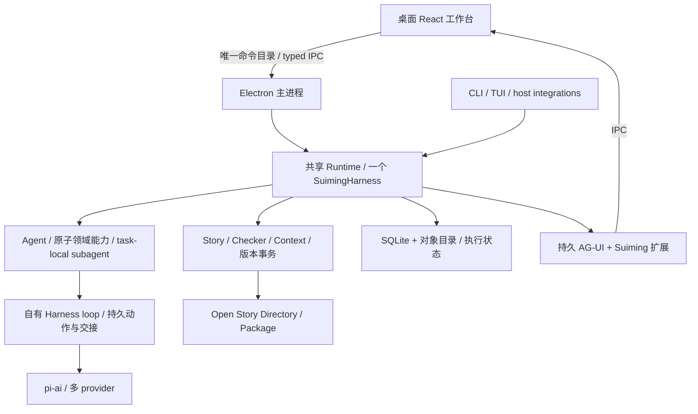

# 重构方案：桌面创作工作台与自主 Agent

日期：2026-09-07。代码基线：main / `262ee4d`。

**状态：历史方案，不是现行规范。**2026-09-07 设计，2026-09-08 落地了自有 Harness、自主 Agent、AG-UI 事件与首个桌面闭环。2026-09-13 的 Session 模型推翻了其中的执行部分：第 2 节表中 Agent、Task / Attempt、agent graph 三行，3.2 的 Run worktree 与合并，第 5 节全部（Run / Task / Attempt、`completed` 的交付判定、预算），7.2 的 ID 表，以及第 9 节「ADR-0010 仍是 Proposed」（它已于 2026-09-12 Accepted）；TUI 已删除，第 6 节的 pi-ai 现为 0.99.2。3.2「自动保存成功才能显示已保存」已被[作者工作台设计](../workbench-design.md)改为手动保存；3.4 拟定的性能门槛（常用操作 p95 小于 200 ms）已移到作者工作台设计第 7 节。现行形状见 [Harness 设计](../harness-design.md)与[系统架构](../architecture.md)，桌面方向沿用 [ADR-0011](../adr/0011-desktop-product-and-autonomous-runtime.md)。

本文收敛此前关于 AG-UI、TanStack AI、Run / Task / Attempt、agent graph、Capability、Codex App Server 与 pi 的讨论，并依据当前代码确定改造边界。[AG-UI 评估](ag-ui-assessment.md)、Agent 自主性评估（已删除，原文见基线提交 `7d50f37`）与 [Graph Engineering 研究](graph-engineering-assessment.md)保留取证过程；本文保留实现缺口与迁移依据；目标规范以需求、架构和技术栈为准，实施顺序以路线图为准。

## 1. 要交付的产品

Suiming 是本地优先的桌面长篇创作工作台。作者可以给出完整创作委托，让专属 Agent 自主推进；也可以连续阅读、直接修改正文、查看设计与人物状态、检查修改依据，并随时调整创作方向。优秀的可视化与交互是核心产品能力，和故事质量、运行正确性一起验收。

桌面端默认具备完整本地能力，打开和编辑作品不要求 Cloud account；联网模型的生成仍需要对应 provider。Cloud 是可选的同步、远程执行与跨设备服务，Web 是后续扩展入口。CLI、TUI 与 host-native integrations 保留完整领域能力，但不承担主要作者界面。

重构应同时交付两条互相验证的路径：

- **自主创作**：作者提出目标 → Agent 自主选择动作 → 阶段提交 → Review / 修订 → 有证据的交付或明确暂停。
- **作者创作**：阅读作品 → 选择段落、人物或问题 → 直接修改或委托 AI → 比较变化与依据 → 继续创作。

当前“固定配方能跑通”和“命令行能操作”分别只是这两条路径的局部基础。桌面端不应等到全部内核做完后才开始设计，也不以一个只读文件查看器作为完成标准。

## 2. 总体决策

| 对象 | 新方案 | 维护边界 |
| --- | --- | --- |
| 核心产品 | Electron 桌面工作台 | 作品阅读、编辑、可视化、Agent 交互与本地生命周期是一体的产品 |
| 模型与执行 | 自行实现 SuimingHarness，继续依赖 pi-ai | pi-agent-core 仅作逻辑参考；不依赖、fork、vendor 内核；Suiming 拥有唯一 loop、恢复与持久状态 |
| Capability | 可组合的领域动作 | 不再定义为一份固定配方；不从 endpoint 或页面反推能力 |
| recipe | 可选创作方法、示例与计划模板 | 步骤和依赖可由可修改的计划表达；允许跳过、修改、组合，不拥有调度状态机 |
| Agent | 一个 Run 内持续负责完整委托 | 一个 SuimingHarness；允许多次提交；不新增外层 Goal / Workflow 服务 |
| Task / Attempt | 保留执行隔离与归因 | Task 是有目标的 agent 工作；Attempt 是冻结模型绑定的一次执行，均不等于一次模型调用 |
| agent graph | 显式组织任务、委派与运行证据 | 允许预规划、动态调整与局部恢复；复用 Task / Attempt / evidence，不新增 graph 执行器或状态库 |
| 界面事件 | AG-UI 标准事件 + 类型化 Suiming 扩展 | 替换旧 RunEvent 词汇；不长期保留两套协议和投影日志 |
| React 客户端 | 桌面首个交互切片采用 `@tanstack/ai-client` / `ai-react` 复用消息状态 | 只管理交互 view state；作品查询用 Router / Query；不引入 TanStack AI 服务端循环与 provider 层 |
| 模型凭据 | 按 provider 的实际认证能力接入 | 删除仅凭订阅标签禁止 automation 的规则及其专用配置 |
| Codex App Server | 当前不作为 managed 执行后端 | 保留 Codex host-native；不预建多引擎抽象 |
| Canon、Checker、evidence | 保持现有领域边界 | 存储、界面、运行摘要都不能成为第二套作品权威 |

自有 Harness 是已确定的执行实现。复用 pi-ai 的模型协议，参考 pi 的执行机制与故障场景，用自己的领域边界实现；不再把供应商对象映射作为架构目标。设计详细程度服务终局恢复与桌面需求，不意味着建设通用 Agent 平台。

这是职责关系图。host-native 的模型执行仍在 host 内；图中的 Runtime 调用只表示复用领域能力，不能据此把 host session 记录成 managed Run。

## 3. 桌面端的终局边界与视觉标准

### 3.1 作品是主阅读面

工作台由可调整的导航区、中央作品面与 Agent 面板组成。默认让正文拥有主要空间；专注阅读可收起其他区域，比较修改时可以切换为并排视图。长篇排版、中文输入、选择与批注、连续阅读位置和键盘操作必须按写作工具的质量打磨。

| 作者要判断的问题 | 主要表示 | 必须支持的联动 |
| --- | --- | --- |
| 这一卷如何展开，哪里尚未完成？ | 卷 / Beat 顺序树、紧凑时间线与状态 | 打开正文、Design、关联人物和未兑现 Contract |
| 这一段写得怎么样，AI 改了什么？ | 连续正文、段落定位、行内或并排 diff | 对照准确版本，选择范围继续修改，保留阅读位置 |
| 某人物此时知道什么、经历了什么？ | 以 Beat 为时间锚点的人物视图、状态变化与局部关系图 | 每个结论能定位原始 Artifact / evidence，切换时点不混入未来信息 |
| 因果、伏笔与承诺在哪里接上或断开？ | 范围可筛选的因果 / Contract 视图 | 从结构边返回原文；区分结构化事实与 AI 提出的解释 |
| 这个 Review 问题是否值得修？ | 问题列表 + 被审文本 + 证据 / 裁决 | 展示报告对应版本及是否过期，定位相关修改 |
| Agent 正在做什么，是否需要我介入？ | 目标、简短进展、当前动作和阶段成果 | 补充要求、暂停、恢复、打开结果；诊断时再展开 Task / Attempt |

故事关系图与 agent 执行图是不同视图。前者帮助理解作品，后者帮助解释计划、运行和结果依赖。执行默认用有层次的 activity 展示；真实分支多到树形难以理解时再增加局部 graph 视图。作者能查看计划如何因新要求或 Review 改变，打开对应成果并调整尚未执行的工作；操作仍走 Runtime 命令。禁止用一张持续闪动的工具节点图代替作者工作台，也不能为了画图建立图数据库或新的作品模型。

可视化从现有 Artifact、硬状态 IR、Frame / 查询与 evidence 派生。作者视图与模型 Context 复用领域选择逻辑，但“作者打开了页面”不等于“模型实际读入了这些内容”；模型读入范围仍由准确的 ContextSnapshot 证明。不能强迫模型每次接收整个可视化页面的数据。

选中正文或图中对象后，作者可以直接询问或要求修改；界面显示可撤销的上下文引用，绑定准确 revision 或候选内容 hash、Artifact 与范围。引用过期时展示版本差异，不能静默移到新稿的同一行。打开引用、返回列表和切换视图都保留筛选、选择与阅读位置。

### 3.2 作者编辑与 AI 修改共存

桌面端通过 Runtime 保存到现有 checkout，使用期望版本 / 内容 hash 防止覆盖外部编辑；保存是 dirty candidate，经 Checker 和版本事务后才是正式提交。不增加独立的 Cloud Draft 或编辑器 Canon，不要求作者离开应用编辑文件。

Editor 的未保存 buffer、已保存候选、Run worktree 候选、已提交版本必须有清楚状态。自动保存成功才能显示“已保存”；AI 运行不抢走焦点、替换当前 buffer 或把阅读位置跳到新输出。外部 host 修改时提示可比较的变化。

AI 在自己的 Run worktree 中工作。作者同时编辑 checkout 时，继续使用同一个合并能力：可证明互不冲突的变化合并后重新检查；重叠且无法确定的变化保留双方并展示具体冲突。没有合并与检查证据前，不宣称两个候选已经整合。回退形成一个新的 revision，已提交历史仍可追溯。

作者可以主动控制提交，也可以授权 Agent 自主提交可回退 revision。不能为每次模型修改强制设置接受按钮；也不能把自动提交理解为可以覆盖作者尚未保存的编辑。

### 3.3 Electron 与长运行

Runtime、Project service、凭据与 Run owner 位于 Electron **主进程**；React 位于 renderer，通过有限的 preload / typed IPC 调用。这里的“同进程 Runtime”指无需外部 daemon 或 localhost server，不是让 Node Runtime 与 renderer 混在一个进程。主进程与 renderer 的职责对应 [Electron 进程模型](https://www.electronjs.org/docs/latest/tutorial/process-model)。

renderer 不获得 provider secret、数据库访问或任意文件执行能力；按命令目录限制 IPC，保持 context isolation。模型生成的 Markdown 和导入内容是数据，不作为可执行应用代码；具体接入遵循 [Electron 安全边界](https://www.electronjs.org/docs/latest/tutorial/security)。

- 切换视图、重载 renderer、关闭创作窗口只解除订阅；有活动委托时主进程继续运行，并提供可重新进入的应用入口。
- “退出应用”是明确的运行边界：停止接受新调用，保存检查点，有界结束在途工作；重开后恢复原委托。不能暗示退出进程或机器休眠后仍能在本地生成。
- 同一 Project 的主进程窗口、CLI 与 host 使用现有锁、lease 和版本检查；打开第二个窗口不会启动第二个 Agent owner。
- 文件扫描、长列表与 diff 使用增量读取；需要后台计算时只移动可替换的纯计算，不复制 Runtime。Electron 选版必须实测内置 Node 与 `node:sqlite` 的兼容性，不能假设系统 Node 24 就代表打包应用兼容。

### 3.4 视觉验收是交付条件

先用真实作品制作并选定主工作台、专注阅读、AI 运行、修改比较、Review 处理、等待输入 / 冲突六类关键状态，再实现完整纵向流程。原型可以使用冻结的真实数据，不建立第二份 mock domain schema。

第一批验收任务包括：从 Review 定位问题并修改；比较 AI 刚提交的正文；判断人物在指定 Beat 的知情；在阅读中调整正在执行的委托；应用重开后回到阅读位置并恢复运行。记录完成时间、误操作和需要解释的地方，不以页面截图好看代替可用性。

以真实 3 卷 30 Beat 作品作为交互验收目标；在真实样本不足时另用明确标记的规模 fixture 压测 300 Beat、百万汉字，不能将其算作创作质量证据。拟定首版性能门槛：本地已加载视图的常用操作 p95 小于 200 ms，输入与滚动不被流式更新阻塞；在公布硬件、数据量和测量方法后验证。宽屏与窄桌面均验收，状态不能仅靠颜色区分，关键动作有键盘路径与可见焦点。

## 4. Capability 从配方中解放出来

Capability 的“原子”表示语义完整、可以组合，不要求模型亲自完成每项底层手续。`freeze` 内部可以完成确定性检查、evidence 构造和持久写入；这些机械步骤不需要再变成多次模型决策。

| 能力组 | 提供给 Agent 的动作 | 确定性实现负责什么 |
| --- | --- | --- |
| 读取与理解 | read、search、Context / Frame、source record 与来源查询 | 准确版本、范围、出处、实际读入记录 |
| 修改作品 | 受范围约束的 read / write / edit、diff、check | 路径、内容、schema、引用、硬状态和差异 |
| 采用与提交 | Design freeze、正文 lineage 绑定、commit、history | 复用已有 service，从文件 diff 内部构造 ChangeSet；证据不得由模型伪造 |
| 委派与审查 | 发起有目标、输入、权限和 profile 的 Worker；独立 Review | Task 隔离、权限、预算、结果归还与 ReviewReport 校验 |
| 委托控制 | 报告进展、请求作者输入、阶段提交、请求完成 | 指令持久化、生命周期与交付条件核对 |

这张表定义能力边界，不是新的工具注册系统。实现复用 Runtime service，公开命令仍只在 `packages/sdk` 的唯一目录定义；CLI、IPC、Fastify 生成适配。Agent 的委派等私有控制工具直接归 SuimingHarness，不创建与 SDK 重复的 capability registry。

具体改变：

- Design 不再固定 authoring → Review → resolution；Agent 根据目标决定是否需要独立审查和修订。
- Write 不强制先写 brief，也不强制分配另一个 Writer；Agent 可以直接写，或把范围明确的写作委派出去。输入隔离是可用手段，不是所有写作唯一合法方式。
- Source 不把固定分块与 fan-in 当作通用阅读路线；确定性解码、定位和超长材料分段保留，是否继续读、抽取或回查由任务决定。
- Review 保留独立上下文、准确被审版本与证据要求。声称“独立 Review”时不能把 Agent 自评当成它；是否调用与如何裁决属于策略。只读 Reviewer 不提交 Canon。
- 支持在 worktree 中试写未定稿设计，但正式采用仍满足 DesignCommit、lineage 等现有边界。探索草稿不新增领域实体。
- `rank` 的随机盲排、重复次数和统计属于明确的 Eval 实验协议，继续确定性执行；不能以“自由决策”为理由让模型修改自己的评测标准。

现有 recipe 中有价值的角色 prompt、方法和示例迁入可选指导，Checker、Context、结果校验下沉为共用能力。旧 `run design` / `run write` 等入口可保留为目标与范围预设，统一启动同一个 Agent；不能藏着旧流程执行器继续维护两条路径。

保留作品范围和提交权限等产品边界，不把某一种创作顺序硬编码成能力限制。当前主线所需动作由领域能力与文件工具覆盖，因此本轮不为抽象的“更自由”新增通用 shell；如果出现无法表达的真实创作动作，应直接补相应能力，重新评估工具范围，而不是要求模型绕路。

## 5. Run / Task / Attempt 与持续自主运行

### 5.1 一份委托，一个决策责任

Run 表示有目标、范围、交付要求和预算的完整委托，可产生多个 ProjectRevision。保留起始版本用于追溯，另保存当前恢复基线。Agent 是唯一作品整合者；每次提交收敛为一个 ChangeSet，不要求整个长委托只有一次提交。

一个 Run 拥有一个逻辑上的 Agent Task。Agent 自己执行普通工具不新建 Task；需要独立上下文、工作目标或评测隔离时才创建子 Task。子 Task 以稳定的委派调用关联父 Task，另用 `dependsOn` 记录真实结果依赖，不用固定序号代替身份。

Agent 可以提前规划任务、执行中细化或替代尚未执行的工作；单步目标也可以直接完成，不强制先调用规划工具。未来任务先声明交付与依赖，Attempt 开始前才解析并冻结准确输入。计划变化在现有执行记录中持久确认，校验依赖、环、在途工作和剩余交付；取消分支不能伪装目标完成。父子关系不等于完成依赖，子任务不能等待正在等它的父 Agent completed。

已完成任务保留历史状态；输入变化后的复查与修订产生新 Task。结果能否继续采用，回查 Context、lineage、Review currency 与当前任务要求，复用现有 evidence 语义。“实际读取”与“可能的故事影响”不等于硬依赖，不能据此自动重写所有关联正文。任务、协作和证据是同一执行过程的关联结构，具体边界见 [Graph Engineering 研究](graph-engineering-assessment.md)。

首版串行委派：Agent 的工具调用等待子 Task 返回，同一 SuimingHarness 记录父调用的等待位置与当前活动子 Task。Worker 不再递归委派，不自由互传消息；同一时刻只有一个获授权的写入执行者。修正当前 `#activeTask` 单槽后，由 owner 向活动调用传递中断和记账；不能直接递归调用会另建 Run / worktree 的旧 recipe 入口。

真正独立的并行工作以后按证据引入，届时必须给出只读快照或写入隔离与合并规则。当前不为尚不存在的并行分支建立调度平台。

Attempt 冻结实际 provider、model、参数、prompt 与工具策略版本，可包含多个模型请求和动作。暂停、进程重启、网络重试沿用原 Attempt；显式换绑定或重试失败工作才新建，并保留同一 Task 已确认的动作身份和消息引用。换模型必须先核对在途效果，在安全边界接续，不能跳过未知请求。改变目标或输入契约另建 Task。Run / Task / Attempt 的状态分工与 ModelCall / Action 记录以[Harness 设计](../harness-design.md)为准。

### 5.2 状态表达真实结果

Run 的目标状态区分待开始、执行中、暂停、完成、取消和失败；暂停附明确原因，例如需要输入、预算不足、无进展、作者暂停或进程恢复。暂停可继续同一 Run，累计用量不清零。不可恢复错误为失败；用户放弃委托为取消。具体 schema 在执行模块实现，UI 不另造平行状态机。

`completed` 只表示交付要求已满足。Agent 请求完成时提交结果范围、版本 / evidence 引用与未做事项；Runtime 验证确定性条件。只有候选、仍有阻塞、预算耗尽或某个工具成功，都不能代替委托完成。如果委托本来只要求分析或产出草稿，则按该要求验收，不强迫产生 revision。

预算内没有新进展时，Agent 应重新选择有依据的动作，或说明无法继续的原因；不能无限重复同一次 Review 直到 pass。无进展判断结合版本、结果和失败记录，不用“连续 N 次没有 commit”否定正常研究。首版不增加每轮必调的独立 verifier 模型。

### 5.3 持久恢复，不让模型猜测已执行的动作

保留 Local SQLite / Cloud PostgreSQL 执行状态与现有 execution object store，扩展现有 checkpoint 和 command receipt 机制；不增加第二套 pi JSONL 会话库。

1. **调用前记录决定。** 在产生副作用前保存稳定动作身份、绑定输入、版本 / 内容 hash、已接受的模型工具调用与执行位置。调用身份跨 Attempt 恢复仍保持；不能只使用新 Attempt 的序号。
2. **结果先保存再交接。** Worker 通过校验工具交付结构化结果或文件引用；完整报告、工具结果、Context 引用和接续所需消息落入执行对象后，才能让父 Agent 消费。父模型收到必要摘要与可回读的结果引用，不承担从最终聊天回复转录完整 JSON 或正文。恢复时已确认结果直接返回，不重新请模型规划同一动作。
3. **作品提交具有可查询 receipt。** 复用现有幂等命令思路，让 revision 写入与提交 receipt 在同一数据库事务确认。checkout journal 继续处理文件系统恢复；文件系统与数据库不是一个原子事务。崩溃后先核对 receipt 和 journal，再推进 Run / worktree 基线。
4. **文件修改可核对。** 待执行编辑记录预期前后内容 hash 与结果对象，恢复时识别尚未应用、已经应用或外部冲突。不能因为缺少工具返回就盲目再做一次相对 edit。
5. **检查点覆盖父子交接。** 父调用在等待、子 Task 已结束、结果已交还分别可识别；多个结果按稳定委派身份匹配。重复通知幂等处理，重启不会重新创建同一 Worker 或漏掉其结果。交付成功不表示父模型已经正确理解，仍需可回读的完整结果和语义验收。

执行对象只持久化恢复、证据和计量所需的原始消息或引用，复用 pi-ai 的消息类型，不再发明 message 协议。它们是可追溯的运行数据；采用的长期结论仍须写回 Story Artifact。UI 事件和 Langfuse trace 都不承担恢复执行的职责。

外部模型请求在进程突然退出时可能无法确认结果和完整计费，不能承诺模型调用 exactly-once。恢复应保留未知状态，明确是否重新请求；作品提交则必须通过幂等 receipt 防止重复。

### 5.4 多次提交、指令与预算一起接续

自己的阶段提交成功后，同时推进 Run 与 worktree 的当前基线，再开始后续工作。现有 `sealInterruptBoundary` 要改为每次提交事务的短暂收口，结束后重新接受中断，不能第一次 commit 后永久脱离控制。

外部 Project head 移动时执行显式 reconcile：复用同一个差异 / 合并能力，重新检查并使过期 evidence 失效；冲突未解决前保留候选并暂停，不能简单去掉 baseRevision 检查。dirty checkout 下候选落地后，如果委托未完成，应继续原 Run，不把阶段提交等同于完成整份委托；旧 `run commit` 候选落地入口已删除。

steer 从“取走即消费”改为持久的接收与应用记录。作者界面明确补充要求作用于当前委托还是新委托；默认补充当前目标。后续 Agent 决策与相关 Worker 都能获得有效指令，已经进行的不可打断事务在结束后应用。改变作品长期 Intent 时显式修改 Artifact，不把聊天文字自动升级为 Canon。

Agent、Worker、Review、重试和失败调用共用 Run 预算；中断后返回的已知 usage 仍需入账。金额显示为可追溯的模型目录估算，订阅场景不冒充实际账单；provider 未返回的用量不能显示成已确认的零。达到上限后阻止新调用，单次在途请求可能超出预估，界面应准确解释这一点。

## 6. 自有 Harness 与模型凭据

执行方向已确定：参考 pi-agent-core 逻辑自行实现，不依赖其 Agent / AgentHarness，不 fork / vendor 或按字段改名搬入其内核，不保留替代执行后端的比较与预留。现有 RunEngine 演进为 SuimingHarness；详细状态、动作恢复、交接、目录和验收见[Harness 设计](../harness-design.md)。

当前项目保留 pi-ai `0.84.4`，pi-agent-core、Agent 与 pi 文件工具依赖已经删除；自有 loop 和受限文件工具在 `runtime/src/harness`。已核对的 pi `0.85.1` / commit `7d8ab31` 具有真实持久 Harness，不能用旧版本的占位实现作为选择依据。pi 源码只作参考；本次没有 fork / vendor 内核，相关 AgentTool、文件工具与 NodeExecutionEnv 引用已完整替换。

pi-ai 继续提供多 provider 调用、消息、工具声明与流类型；Context Compiler 负责准确输入、裁剪和压缩后的来源引用，自己的执行存储负责消息、调用、动作与 checkpoint。复用已有领域服务、receipt 与 journal，不增加第二会话库。显式 profile 选择模型，Agent、Writer、Reviewer 可以不同，也可以相同，不新增智能 Router。

删除 `INTERACTIVE_ONLY_API_KEY_PROVIDERS` 与 `isSubscription` 联合形成的统一 automation 拒绝，以及仅服务于它的 `ModelCredentialUse`、`--credential-use`、binding / event / trace 字段。实际 provider 认证、额度与限制继续按真实能力处理。

桌面提供同源 profile 和账号设置，复用 pi-ai 的 API key / OAuth 能力；secret 留在用户凭据边界，renderer 只看状态和非秘密配置。未通过真实登录、刷新、调用、取消与失败恢复验收的方式不能标为支持。host-native 继续使用 host 的模型、会话和凭据，经 checkout 与 suim 领域命令交付，不制造 managed Run。

## 7. AG-UI 与桌面客户端

### 7.1 一份界面事件契约

采用标准消息、工具、Step / Activity 与交互生命周期；Suiming 的作品版本通知、持久委托状态和业务摘要使用有 schema 的扩展。不是所有业务动作都必须挤进标准工具事件。[AG-UI 事件规范](https://docs.ag-ui.com/concepts/events)

自有 Harness 直接从执行确认点与 Runtime 状态变更产生产品事件，保存后经 IPC、subscription 或 SSE 发送。删除旧 RunEvent 的并行定义，不保存 pi 事件日志，不建设 RunEvent → AG-UI adapter 服务。pi-ai 流仅是模型输入，不能绕过持久状态直接成为 UI 的运行真源。

对外消息需要稳定 ID、开始 / 增量 / 结束及刷新恢复。消息属于运行数据；完整正文、worktree 与大体积 write / edit 参数仍通过领域查询读取。可以公开的真实参数才使用 TOOL_CALL_ARGS，大内容修改用 Activity + 引用展示，不能把摘要伪装成实际调用参数。

### 7.2 ID、启动与重连

| 身份 | 含义 |
| --- | --- |
| Suiming Run ID | 一份持久委托，跨暂停、重启与阶段提交保持 |
| AG-UI `threadId` | 对应 Conversation |
| AG-UI `runId` | 一次启动 / 续跑的交互执行区间，通过 metadata 关联持久 Run |
| Task / Attempt ID | 实际工作与执行绑定，作为业务关联，不冒充协议 runId |

交互 ID 在启动命令确认时持久分配，可从 receipt / checkpoint 找回，不增加交互业务表。事件信封保存持久 Run 与单调序号，AG-UI payload 保持标准类型；一次交互结束不等于委托完成，不能滥用 `parentRunId` 关联两种 Run。

明确选择 **命令启动、只读 attach** 的接入方式：开始、steer、暂停、恢复调用唯一 SDK 命令，并对启动 / 恢复使用幂等身份；attach 只按游标订阅已有执行。桌面实现 IPC connection adapter；将来 Web adapter 使用领域命令加 GET SSE attach，不直接把默认重连 POST 当成开始新 Run。[TanStack Connection Adapters](https://tanstack.com/ai/latest/docs/chat/connection-adapters)

等待作者回答使用标准 interrupt / resume；用户主动暂停先调用 Runtime，确认后通知真实业务状态并结束当前协议交互。断线只取消订阅，不中断委托。不能用 `RUN_ERROR` 表示主动停止，也不能把 `RUN_FINISHED` 当成完成作品的证据。

### 7.3 持久性与客户端职责

持久状态变化和相应事件必须可原子确认或从同一 checkpoint 幂等补发。2026-09-08 已在现有入口修复“持久化订阅者失败仍向界面发布”的缺陷；存储错误不能被当作可忽略的 UI listener 错误。文本增量允许短批合并，**批次持久化后再发布**，不先展示不可恢复的正文式 transcript。checkpoint 若已包含完整消息，恢复时可以幂等补齐其尚未发布部分。

attach 返回对外消息快照与同一持久边界的游标，再补后续事件；重叠去重、进行中消息与已完成历史都要验证。快照是同一事件与消息数据的查询结果，不是第二套会话真源。UI 回读准确版本的 diff 和 Artifact，不依靠拼接事件还原作品。

`ai-client` / `ai-react` 管理消息与流式交互，Query 管理作品、版本和持久 Run 查询。Suiming 编写业务 activity / Review / diff 组件与连接适配；不让 ChatClient 的 loading、stop 或 retry 决定后台 Run 生命周期。原有兼容性探针已由真实 Electron typed IPC 闭环验收补充，覆盖消息快照、作者回应、正文、Review、外部修改与版本提交。

AG-UI 标准 schema 复用上游，Suiming 扩展使用自己的 TypeBox 边界。实施先验证标准 schema 与现有 TypeBox 命令生成的接缝，必要时在传输边界组合校验，不手抄标准字段。如果真实 IPC 证明 TanStack 某项客户端抽象不合适，局部替换 view state 即可，不能倒逼 Runtime 改语义或恢复旧自定义协议。

## 8. 实施顺序与验收门

桌面端与创作内核是一条产品主线。视觉和交互设计从第一阶段开始，生产工作台随正确的执行与事件边界接入；不再将桌面视觉冻结到整个长篇质量验证门之后。真实正文、作者修订与盲选持续进行，不等待 UI 完成。

S0–S5 的唯一详细任务清单与状态见[路线图第 4 节](../roadmap.md)。S0 规范与六类界面状态已有实现与截图检查；S1 的 H1–H3 完成自有状态、循环与交接，S2 的 H4 完成持续 Agent，S3 / S4 接统一交互并交付桌面闭环，S5 深化长篇、可视化与发行。2026-09-08 已落地 H1–H4 主路径、AG-UI / TanStack / IPC 和首个桌面闭环，并以 DeepSeek V4 Flash 完成一次有预算上限的真实委托。详细验收与剩余缺口见[当前状态](../current-status.md)。

第一条产品验收固定为：一次真实委托在桌面内完成修改、独立 Review、作者介入、比较与提交，中断或退出重开后继续原委托，并能显式更换模型。设计选择没有证明质量优于 Codex，真实作品与盲选持续提供证据。

S0 原型和既有作品质量工作可以与内核修正并行，但不通过在 renderer 临时复制 Run 生命周期抢跑。S3 迁移已有 Cloud 协议 adapter 保持契约一致，不借此启动 Cloud Agent host、Web 产品或完整云服务建设。

桌面源码使用 `apps/desktop` 承载主进程 / preload；按现有规划用 `apps/web` 承载共享 React 工作台，名称不代表 Web 优先，不提前建立另一套 UI package。首个 renderer 就通过平台 adapter 接入唯一命令和事件契约，未来真正出现第二个使用者后再按需要移动代码。

桌面发行按作者现有 macOS 环境先验证，同时不把核心逻辑绑死在 macOS；其他平台必须经过自己的打包、输入、路径与退出恢复验收才能标为支持。安装 / 升级、作品备份与导出、凭据恢复和迁移失败后的恢复路径属于发行验收，不以开发服务器能打开窗口代替桌面交付。

### 必须删除或替换的实现

- `engine/*-recipe.ts` 中固定创作步骤的调度职责及旧入口分派；保留并迁移有用 prompt、领域检查和 Eval 协议。
- `RunRecipeBinding` 驱动的恢复分派、按位置 + Task kind 猜测重放、提交即终止整个委托的假设。
- pi-agent-core 的 Agent、工具类型、文件工具与 NodeExecutionEnv 接入，随同一 Harness 迁移完整移除。
- `#activeTask` 单槽、steering 取走即遗忘、单一不可推进的 worktree 基线。
- `ModelCredentialUse` 及其专用选项 / telemetry / schema 分支，不保留没有独立用途的开关。
- 旧 RunEvent 字段词汇、自写通用消息拼装与任何长期双协议投影；业务视图与传输适配继续保留。

源码变更主要落在 Runtime Harness（`packages/runtime/src/harness`）、execution（`packages/runtime/src/execution`）、local（`packages/runtime/src/local`）、model（`packages/runtime/src/model`）、SDK（`packages/sdk/src`）和现有 app adapter。`packages/story` 仅在现有领域语义确实缺能力时修改，不因新循环或 UI 复制 schema。

每一阶段作为完整纵向变更验收，避免长期维护新旧两个 Agent。开发期旧执行数据可以一次性转换或封存只读档案，不建设 legacy runtime；真实作品、revision、evidence、作者选择和修订记录先备份验证，不能随着数据库重置一起丢弃。

## 9. 验证范围与明确不混入的工程

机制测试验证恢复、事务、协议与客户端；真实模型测试验证工具可用、任务选择和跨 provider 交接；作者盲选与长期作品验证文学质量。现有样例、AG-UI 探针和代码分析不能证明动态 Agent 一定比固定流程写得更好。

调度对照保持同作品、Intent、模型组合、角色契约与总预算，比较固定链和自主执行的交付率、人工干预、确定性错误、作者盲选及总用量。host-native 作为另一个产品体验参照，不能在模型与 Context 不同的情况下把结果全归因于架构。

Graph Engineering 的增量收益另与具备相同能力和可靠交接的自主 loop 对照；只比较固定 recipe 无法分辨收益来自自主决策还是显式依赖。先验证结果保存与父调用接续的故障窗口，再比较局部恢复、人工干预与创作质量，具体试验见 [Graph Engineering 研究](graph-engineering-assessment.md)。

以下工程不作为本次重构前置：通用 graph / workflow engine、智能模型 Router、多 agent 蜂巢、自动 verifier 平台、向量数据库、CRDT、全功能 MCP、Cloud identity / 计费、Cloud Web 或 Codex App Server 第二后端。

[ADR-0010：git 作为 Canon 存储引擎](../adr/0010-git-as-canon-storage-engine.md)仍是独立 Proposed 决策，本轮不默认为已接受。自主运行和桌面端继续基于现有 ProjectRevision / store port；未来底层存储选择不能改变作品权限、evidence 与提交恢复的验收条件。

## 10. 对现行规范的修订清单

2026-09-07 已把以下目标同步到现行规范。这里记录被替换的旧约束，不能据此推断代码迁移已经完成：

| 已替换的旧约束 | 新方案的修订 |
| --- | --- |
| 桌面条件启动，Cloud Web 是终局旗舰或届时重审 | 桌面是已确定核心产品；工作台视觉纳入主线，Cloud Web 为可选扩展 |
| 一个 capability 是一份 recipe | Capability 是可组合领域动作，recipe 是可选方法 |
| Run 结束一次配方，所有候选形成一次 ChangeSet | Run 完成完整委托，每个阶段提交各形成一个 ChangeSet |
| 依赖 pi-agent-core 的 Agent 内循环 | 参考逻辑自行实现 SuimingHarness，继续依赖 pi-ai；不 fork / vendor 或增加 Session / Lane / Operation 层 |
| 重启或暂停恢复新建 Attempt | 延续同一 Attempt；只有显式换绑定或重试失败工作新建，已确认动作不重做 |
| AG-UI 仅第三方投影，事件只含摘要 | 原生标准消息 / 交互事件与业务扩展；对外消息可持久，作品正文仍走领域读取 |
| 订阅凭据默认禁止 automation | 按真实 provider 能力处理认证、额度和限制，删除无独立依据的统一禁止规则 |
| 桌面首期只读、编辑跳外部工具；视觉线整体冻结 | 作者在工作台完成阅读、编辑、比较与委托，视觉设计与内核开发互相验证 |

已同步 AGENTS、README、需求、架构、技术栈、作者工作台设计、路线图与当前状态，并新增 ADR-0011；执行方向、Attempt 边界与恢复规格由 ADR-0012 和 Harness 设计进一步收敛。历史 ADR 保留当时背景并注明修订；可执行的 host Skill / adapter 随 S2 更新与测试，共享 Skill 与生成的安装文件已同步当前入口、暂停恢复、阶段提交和标准事件。

本方案完成的判据是：作者主要在桌面端完成真实长篇创作；自主 Agent 能自由组合已有能力并持久交付；作品变化、依据和运行状态清楚可见；核心边界各有一套实现，没有为采用标准或现成框架额外叠出另一套运行真源。
