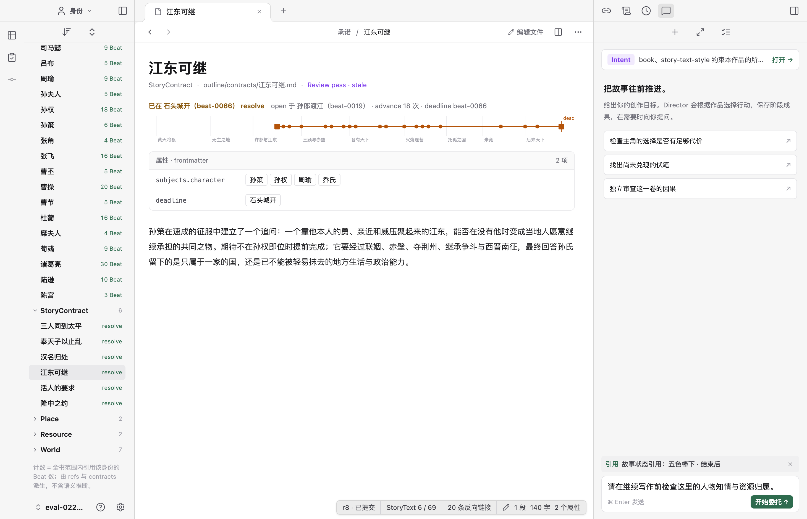
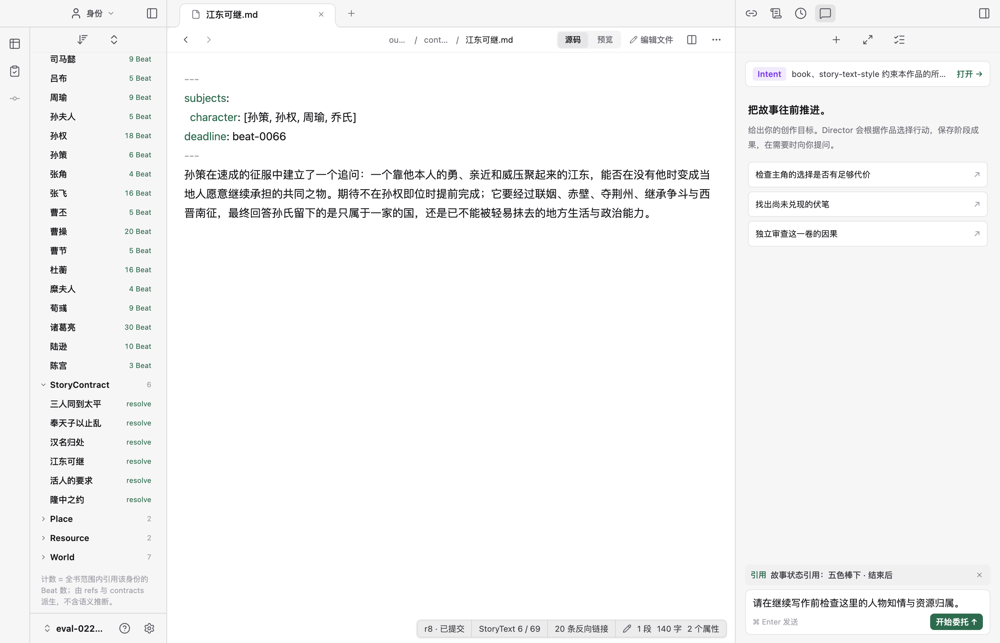
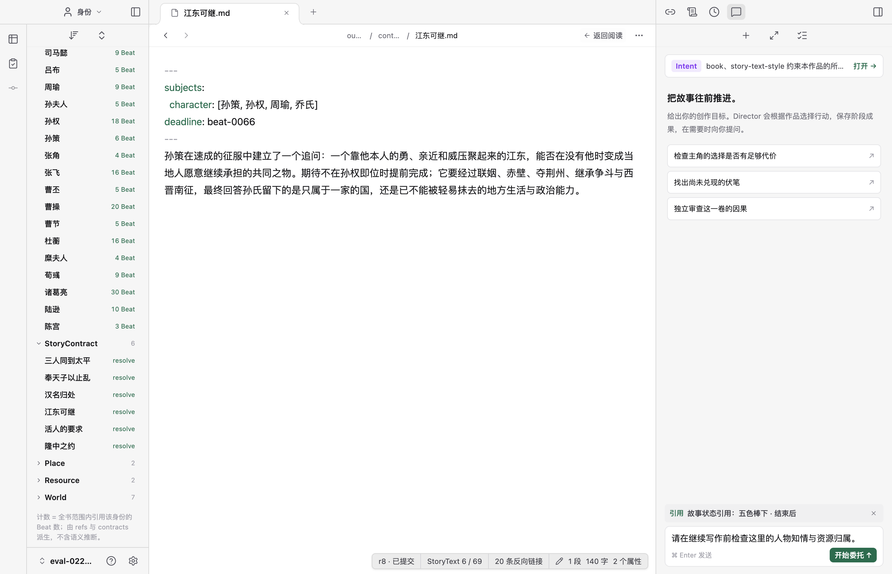
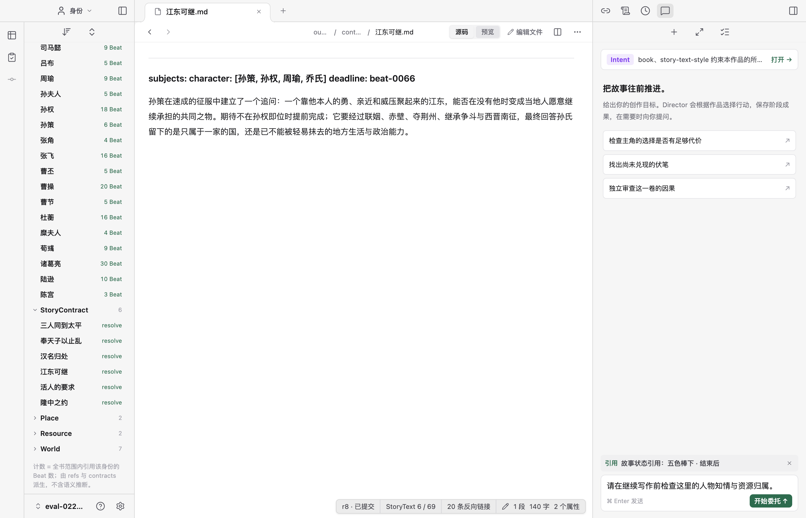
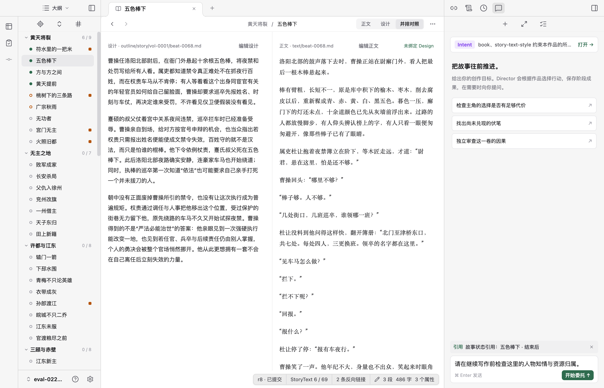
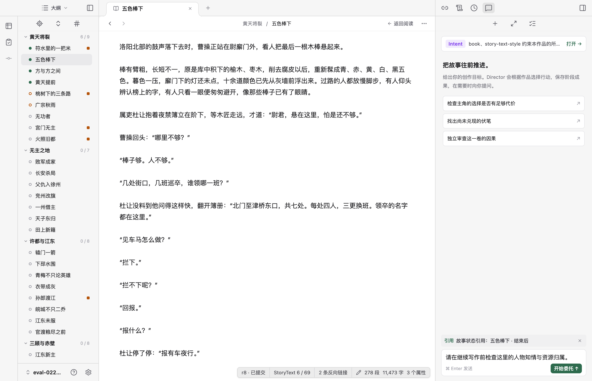
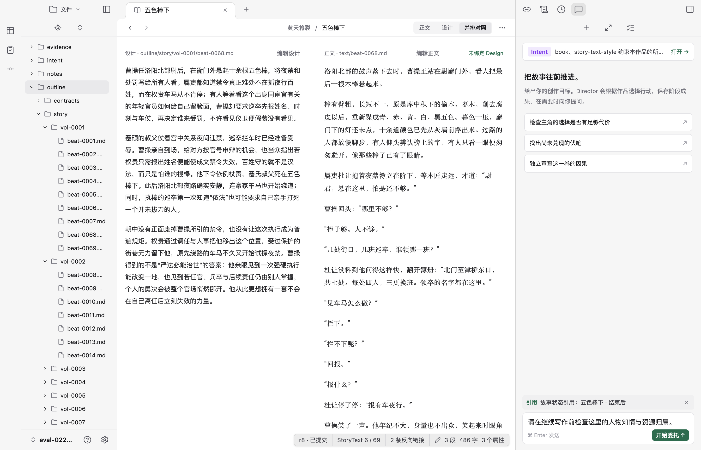
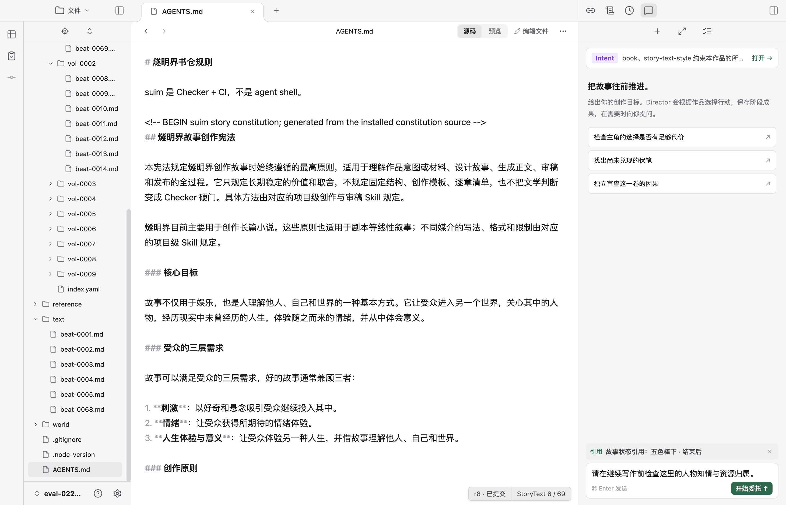
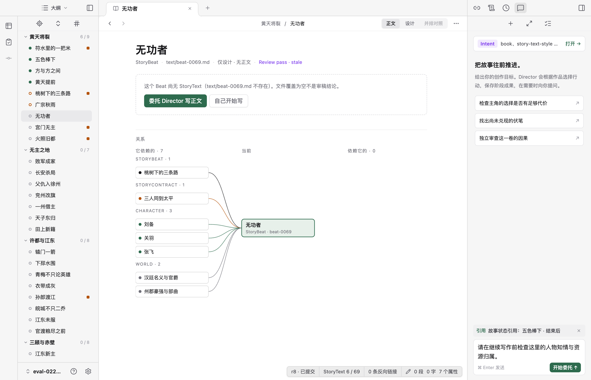
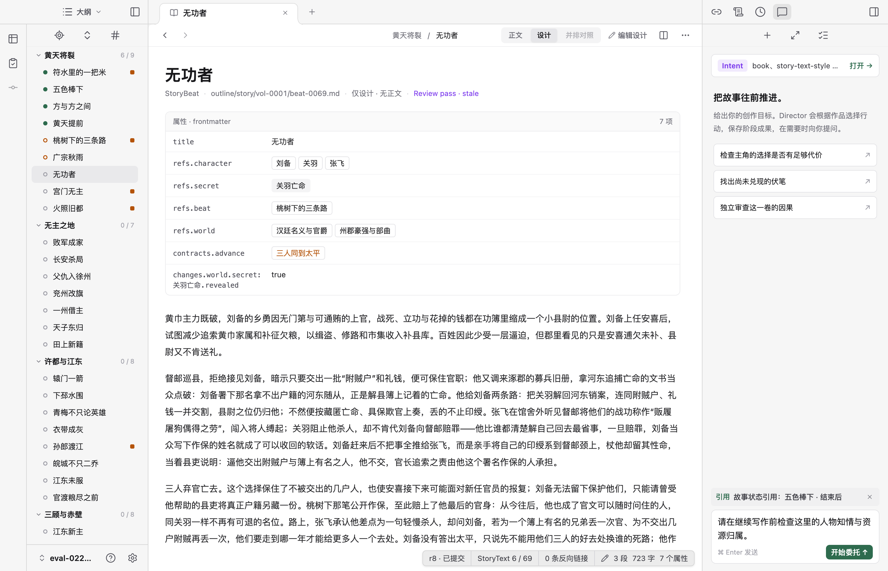

# 阅读、编辑与对照模式审查

2026-09-09。检查当前 Electron 预览、React 实现与 Obsidian 官方说明。以下保留实施前的审查现场。后续已落实内容组织、菜单和通用分屏，见[实施验收](../2026-09-09-view-implementation/README.md)。

## 模式归类

| 当前入口 | 实际职责 | 当前行为 |
| --- | --- | --- |
| 正文 / 设计 | 内容对象 | StoryText 与 StoryBeat 是不同 artifact，不是同一文件的两种显示方式 |
| 并排对照 | 内容布局 | 同时阅读设计和正文；两列分别提供编辑动作 |
| 源码 / 预览 | 原始 Markdown 文件的显示方式 | 两者都只读；源码显示标记，预览渲染 Markdown |
| 编辑正文 / 编辑设计 / 编辑文件 | 修改当前目标 | 使用可编辑的源码编辑器；没有 Live Preview |
| 版本差异 | 修改审查任务 | 比较已提交或外部内容与当前候选，当前一侧可编辑 |

大纲、文件、身份、依据、搜索属于左栏导航；右栏和故事状态查询属于辅助工作面。它们不应与文档阅读、编辑合并计数。当前控件按页面和任务条件显示，并非所有模式都能任意组合。

Obsidian 区分 Reading view 与 Editing view；Editing view 下又有 Live Preview 和 Source mode。Live Preview 可编辑，只在需要时显露语法；Source mode 显示完整语法。我们当前的只读预览不等于 Live Preview。来源：[Obsidian 官方说明](https://obsidian.md/help/edit-and-read)。

根据作者补充进一步核对：Reading view 的正文不能直接输入，但属性仍可通过独立控件编辑。因此不能把它概括成“整个文件只读”，阅读视图不是文件权限或锁定状态。来源：[属性说明](https://obsidian.md/help/properties)、[官方论坛关于阅读视图属性编辑的说明](https://forum.obsidian.md/t/hide-the-add-property-button-in-reading-mode/66156/2)。

## 现场流程与截图

### 1. 阅读作品对象：基本清晰

承诺页面显示标题、关系轨迹与结构化属性，阅读不要求理解原始文件。编辑动作仍叫“编辑文件”，与作品对象的语境不完全一致。

### 2. 查看原始文件源码：状态区分不足

显示 YAML 与 Markdown 标记，但编辑器只读。顶部同时存在“源码 / 预览”和“编辑文件”，需要额外理解两套切换。

### 3. 编辑原始文件：功能明确，视觉差异弱

进入后同一份源码变为可输入，主要可见差异是工具栏变成“返回阅读”。未修改内容时，没有进一步凸显编辑状态。当前输入区域有可访问名称，不能据此断言读屏整体体验已验收。

### 4. 查看原始 Markdown 预览：存在显示缺陷

YAML frontmatter 被当成 Markdown 正文，其中字段合并成了标题。与步骤 1 同一文件的属性表呈现不一致。应正确分离属性与正文，避免给作者提供语义不同的两份阅读结果。

### 5. 并排阅读设计与正文：有明确用途

两份内容同时可见，各列有明确的编辑目标。它是布局选择，不是第三种内容对象。

### 6. 从对照中编辑正文：参考上下文丢失

点击“编辑正文”后，两列消失，进入单栏源码编辑。正文、设计选择也从顶部消失，只剩“返回阅读”；当前正在编辑哪份内容不够显眼。点击返回能恢复双栏，流程可返回，但不能保持设计参考并修改正文。

## 建议优先级

1. 统一普通文档的阅读 / 编辑切换。可编辑文件不再常驻独立的只读源码模式；精确查看源码仍可通过明确入口提供。只读历史快照等场景保留只读能力。
2. 正文 / 设计保留为内容选择；并排对照归为布局操作。进入编辑后保留当前目标标识，并支持对照时编辑其中一列、另一列保持参考。
3. 版本差异保留为独立审查任务，从更多、历史或待保存改动入口进入，明确比较双方；不与设计和正文对照共用模糊的“比较”命名。
4. 修复原始文件预览的 frontmatter 处理，统一阅读内容的语义。对象页使用“编辑承诺”等对象名称，原始文件页才使用“编辑文件”。可编辑的作品属性适合在阅读页面用明确的字段控件就地修改，无需为修改一个属性进入整页源码；这些修改仍进入同一候选，不绕过校验与提交。派生状态和历史快照不因此变成可写。
5. 为面向作者的正文规划 Live Preview 编辑，源码作为编辑方式的次级选择。必须真正具备语法隐藏与原地编辑后才出现该名称；设计属性仍需正确保留结构与语义。

切换内容、阅读、编辑或对照均不应隐式提交作品；共享草稿、返回位置和保存候选与提交作品的区分继续保留。

## 验证范围

截图均在本次审查中捕获并检查。现场切换了阅读、只读源码、源码编辑、Markdown 预览、并排对照和返回；没有输入、保存或提交作品。版本差异的可编辑行为来自本次源码核对。未重新执行键盘、读屏、窄屏及完整自动回归，不作全面可访问性结论。

## 作品页面与项目文件的组织建议

后续命名已统一为「源文件」，入口为「查看源文件」，左栏仍叫「文件」。下文的「原始文件」保留当时审查语境，当前规则以[作者工作台设计](../../web-product-design.md)为准。

作者进一步询问“原文 / 作品”与文件夹入口的必要性。以下仍是讨论建议。

原始文件与作品页面不宜称为两种全局模式，也不宜命名为“原文 / 作品”；“原文”容易与小说正文、参考作品的原文混淆。采用“作品页面 / 原始文件”，侧栏入口继续简称“文件”。

作品页面以人物、情节等对象组织内容。一个情节同时关联设计与正文两份文件，不能把作品页面简单理解为单个 Markdown 文件的预览。原始文件页面以实际路径为目标，处理精确源码、辅助文件与无法解析的文件。它们共享同一份文件草稿和保存语义。

建议保留文件夹作为辅助导航，默认入口仍是大纲。点击文件夹入口只切换左栏；文件树中的文件稳定打开对应文件页面。作品页的更多菜单提供“打开设计文件 / 打开正文文件”；已识别文件提供具体的“查看对应情节 / 人物”等入口，避免“查看作品”被理解为打开整本书。

常规阅读、正文编辑、属性修改和设计对照应在作品页面完成，无需经过文件树。原始作品文件页聚焦查看和修改源码，不再额外复制一套作品阅读呈现；没有作品对象的普通 Markdown 文件仍需阅读与编辑能力。文件入口不扩展成完整文件管理器。

文件入口有独立用途：访问 `AGENTS.md` 等辅助文件；在解析失败时读取源码与诊断并修复；按精确路径核对外部工具或 Agent 修改；浏览 portable evidence 文件。证据可查看不代表可改写，辅助文件也不会因可编辑而进入作品提交。

### 本轮补充流程 1：切换文件导航，中央内容保持——正常

从大纲切到文件后，中央仍是“五色棒下”的设计与正文对照，面包屑未改变。文件导航与作品页面可以同时存在，已经不必理解成互斥模式。

### 本轮补充流程 2：打开辅助文件——功能有效，显示层次可收敛

文件树能打开 `AGENTS.md`，页面按真实文件名显示，提供查看与编辑。它没有对应的情节或人物对象，说明文件入口不只是重复作品目录。当前仍显示“源码 / 预览 / 编辑文件”，应随前面的模式简化建议统一处理。

补充核对 `project-files.ts`、`local-workspace.ts` 与现有 `workspace.test.ts`：文件目录独立于作品投影，辅助文件保存与非法文件修复具有明确实现与测试用例。本轮未重新运行这些测试，也未故意损坏预览项目；异常恢复的结论来自源码核对。截图不能证明完整的键盘与读屏体验。

## 连续查看设计却打开空正文

作者反馈希望查看设计时仍打开尚无内容的正文。本轮按实际操作复现，未修改实现。

1. 在“五色棒下”选择设计，再从大纲打开“无功者”：页面自动选中正文，显示不存在正文的空态。连续浏览意图没有保留。
2. 点击同页的设计：能看到完整情节安排和七项属性，说明内容本来可用，问题在默认打开选择。

源码原因：`pageState()` 默认 `beatView: "text"`；大纲普通点击调用 `open(beat.path)`，新目标重新构造默认页面，不沿用当前设计选择。已打开页面的普通激活与历史恢复另有保存规则，因此不能概括为所有打开行为都丢失状态。

建议以同一情节关联设计与正文，首次从大纲打开优先设计，连续浏览沿用当前窗格的明确内容偏好；普通正文浏览遇到未开始正文时显示设计，显式正文请求仍可进入写作空态。详细优先级和分屏边界已写入[视图、分屏与菜单方案](../../workbench-view-and-menu-proposal.md)。
