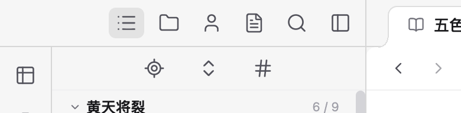

# 导航收纳阈值与默认大纲修正

日期：2026-09-09。作者截图指出 266px 左栏仍有空间，但上一轮按固定 280px 阈值切成菜单；同时要求默认以作品对象为中心，打开大纲入口。

## 修正结果

- 去掉固定栏宽阈值。导航图标组成独立的一组，共享连续空间；移除多余弹性占位及其间距。用 ResizeObserver 观察导航可用空间和完整图标组的实际宽度，只有完整图标放不下才收纳。
- 保持既有按钮尺寸与间距，不通过缩小按钮腾位置。266px 左栏下，五个图标组为 174px、可用宽度为 175px，全部显示；收起按钮也在栏内。当前样式下 264px 栏宽才切成菜单，阈值由实际布局派生。
- 收纳后，测量用图标组不可见且 inert，不进入点击、键盘或辅助技术导航；菜单仍保留全部五项及选中状态。
- 「顺序」统一更名为「大纲」，排在文件按钮之前。首次打开保持既有 `side: spine` 默认值，导航和页面仍以作品对象为中心；已有工作现场按作品恢复，不在每次重载时覆盖作者选择。

## 验证

- `npm run check:web`、`npm run check:types` 和前端生产构建通过。
- 本轮修改文件的 Biome 检查、文档链接检查、`git diff --check` 通过。
- 导航与分栏单元测试 5 项通过；Electron 完整回归 7 个场景通过。
- 分栏场景增加首次打开大纲选中且排首位、266px 显示全部图标且按钮不越界、264px 才收纳的断言；保留导航独立、窄栏五项切换、草稿保护和宽度恢复验证。
- 在作者截图对应的预览窗口直接重载，保留 266px 左栏、当前大纲与正文。实测图标位置为 x=92、128、164、200、236，宽度均 30px；收起按钮 x=273、宽度 30px，未超过左栏右边界 x=310。未捕获 renderer 页面异常。

[完整窗口](01-outline-266px.png) · [顶部局部](02-outline-header.png)

