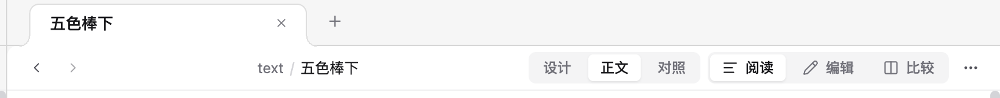
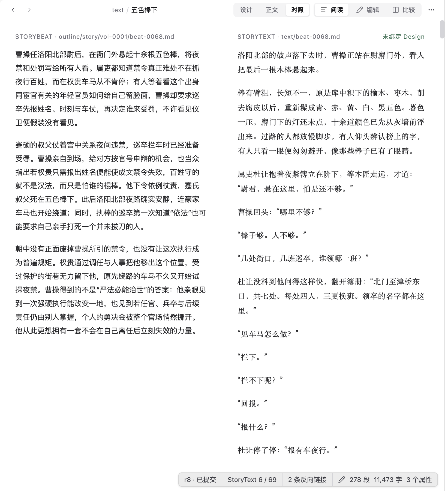
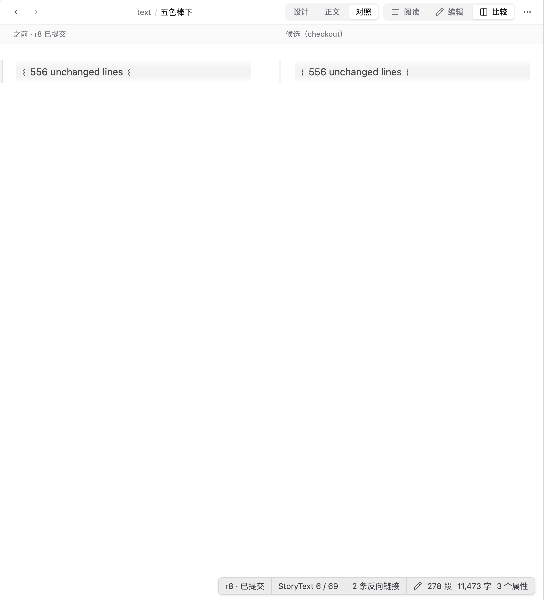
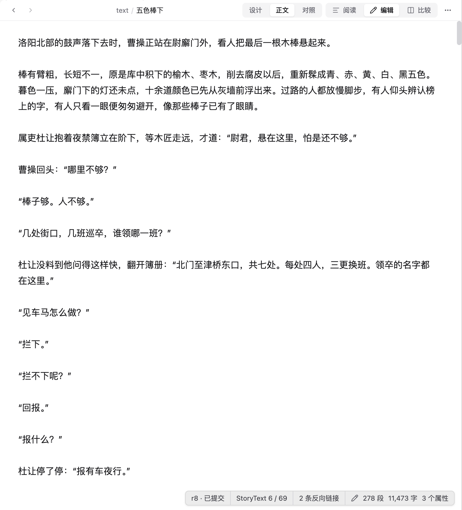

# 文档工具栏与面包屑审查

日期：2026-09-09。范围：用户截图中的标签页、历史导航、面包屑、内容视图、阅读 / 编辑 / 比较与更多菜单。通过作品副本在 Electron 中复现；未修改作品或产品代码，审查后恢复到「正文 + 阅读」。

> 后续讨论已收敛为[导航与文档交互优化方案](../../workbench-navigation-optimization.md)。本页保留问题证据；先前直接左对齐或删除面包屑的建议已撤回，以下结构表同步最终方向。

## 结论

上一轮统一了尺寸、边界与对齐，但没有理清操作语义。两组外观相同的分段控件暗示可以独立组合，实际会互相覆盖；面包屑显示的是处理过的文件路径，不能稳定表达作品中的位置。这些问题需要调整交互结构，仅更换文案或间距不足以解决。

## 逐步证据

### 1. 正文阅读：需要改进

「设计 / 正文 / 对照」与「阅读 / 编辑 / 比较」占据同等视觉层级。前者控制内容展示，后者混合阅读、编辑与版本差异任务，用户需要先理解六个选项之间的关系。

`text / 五色棒下` 既不是完整文件路径，也不是故事层级：`text` 重复了「正文」的状态，当前标题重复标签页，但没有增加所属卷信息。实际检查该面包屑没有可点击的父级。当前按剩余空间居中的实现，使其位置受右侧操作数量影响；居中布局本身不构成问题。

### 2. 点击「对照」：功能有效，标识不足

页面并排显示 StoryBeat 设计与 StoryText 正文，功能有独立价值。但「对照」没有说明比较对象，面包屑仍然显示 `text / 五色棒下`，不足以代表当前页面。

### 3. 继续点击「比较」：状态与内容不一致

「对照」和「比较」同时高亮，但实际只显示同一正文文件的已提交版本与 checkout 候选差异，设计与正文并排视图已消失。保留高亮的「对照」向用户传达了错误状态。这是可复现的交互问题，不只是名称近似。

### 4. 从对照进入编辑：编辑目标不明确

返回阅读后进入「编辑」，系统自动把「对照」改为「正文」，编辑目标随之确定为正文。按钮没有事先说明会编辑哪一栏，用户无法从「编辑」这个名称预测这一跳转。

## 建议的结构

| 区域 | 建议 | 交互约束 |
| --- | --- | --- |
| 标签页 | 继续表示打开的作品对象 | 当前对象不因正文、设计或差异视图改变身份 |
| 历史导航 | 保留后退 / 前进 | 明确是当前标签页的访问历史，不借用为前后 Beat |
| 文档位置 | 保留居中面包屑；作品页显示语义位置，文件页显示真实路径 | 由中央页面身份派生；切换左栏不改变内容或路径，同一 Beat 切换表示不改变归属；有效父级可定位 |
| 内容视图 | 保留一组「正文 / 设计 / 并排对照」 | 三项明确表示展示内容，消除第二组看似独立的模式选项 |
| 编辑 | 独立动作，注明「编辑正文」或「编辑设计」 | 并排视图在对应栏提供明确入口；编辑期间突出保存与取消，不静默选择目标 |
| 版本差异 | 独立入口，命名为「版本差异」 | 进入后明确文件及双方版本，替换普通内容控制；提供返回原视图的动作，避免无效选项继续高亮 |
| 更多 | 只承载实际存在的低频操作 | 没有菜单项时不显示空入口 |

代码还显示，当前更多菜单的唯一条目「单独打开正文文件」仅在 Beat 存在正文时生成，但菜单触发器覆盖其他 artifact。这个空菜单风险来自代码检查，本轮没有逐类点击验证。

验收重点应是：每个高亮都对应当前真实状态；每个操作都能预测目标；同一个 Beat 的归属不随内容表示改变；并排对照与版本差异不会被混淆。控件的尺寸、图标、分隔与间距在这一结构确定后统一。

## 范围限制

本轮检查了一个有正文的 Beat 及上述四个状态，没有进行完整键盘、屏幕阅读器或所有 artifact 类型的无障碍审查。未改动产品实现，因此没有重跑产品测试。
