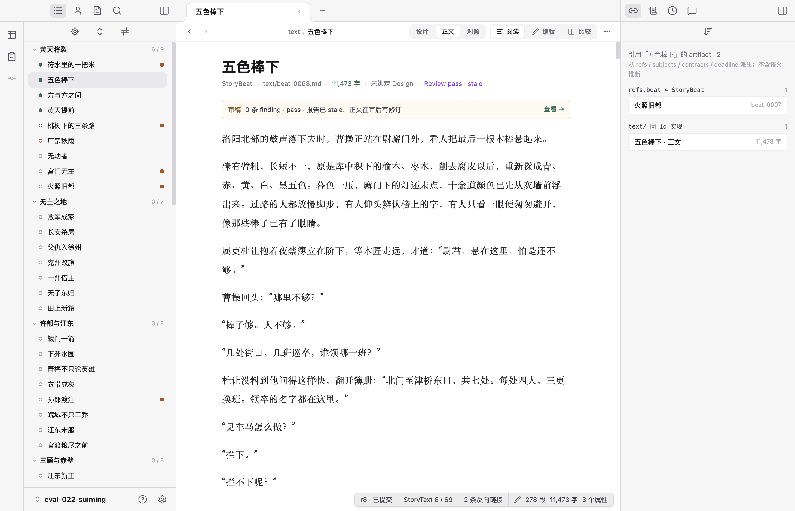
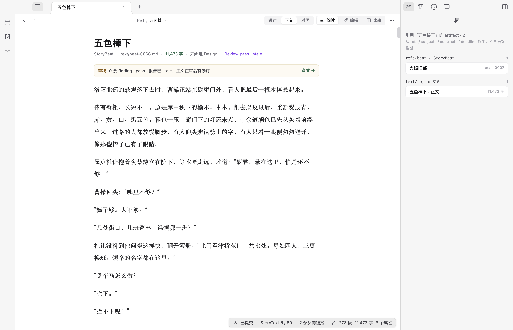

# 导航补充分析（中间判断已撤回）

日期：2026-09-09。针对作者追问「左边已有后退 / 前进，面包屑还需要对齐吗」，检查完整界面、目录收起状态与导航代码。本页保留当时的截图、推导和范围记录，尚未修改产品实现。

> 后续作者提供 Obsidian 截图，并继续明确文件浏览、页面身份与 tab 行为。以下「删除面包屑」的中间结论已撤回：标题重复不足以作为删除依据，应保留居中位置栏，作品页显示语义位置、文件页显示真实路径，且不随左栏改变。实施只以[最终优化方案](../../history/workbench-navigation-optimization.md)为准。

## 当时判断（已撤回）

文档页应删除当前文件路径式面包屑，保留历史导航；把有用的卷归属放在正文标题附近，并提供在目录中定位当前文档的操作。工具栏中间允许留白，不为了填满空间重复显示标题。

后退 / 前进与面包屑职责不同，但「职责不同」只能说明它们可以共存，不能证明两者都应常驻。判断依据应是当前工作台是否已经提供了同一信息或同一操作，以及收起面板、跨对象访问时是否仍能定位。

## 1. 目录展开：对象选择清楚，标题重复

完整截图显示：左栏已展示卷 → Beat 的结构并高亮当前 Beat；标签页用于切换打开的对象；正文有独立标题。工具栏又显示 `text / 五色棒下`，成为第四处同名显示，但没有增加父级信息，也不能导航。

历史箭头有独立价值。代码中的 `go()` 使用当前标签页的访问栈，允许作者从正文打开人物、证据或审稿后返回；它不表示故事顺序中的前后 Beat，不能替代卷目录。

## 2. 目录收起：当前对象仍清楚，作品位置缺失

收起目录后，标签页和正文标题仍然标识当前对象，原有面包屑依然只是重复标题。真正丢失的是所属卷，而 `text` 不能补足这一信息。新增一条可导航长层级并非唯一解：在文档标题的辅助信息中展示所属卷，就能保留语境；需要查找邻近 Beat 时，再定位到已有目录。

这项定位必须针对当前打开的文档，不能误用与文档独立的故事状态观察位置。目录收起时可展开并定位，已有目录打开时只展开所属卷并滚动到该文档。

## 区域分工

| 区域 | 要解决的事 | 不重复承担 |
| --- | --- | --- |
| 左侧目录 | 查找、选择卷内及跨卷对象 | 不记录访问历史 |
| 标签页 | 保留和切换打开的对象 | 不展开文件路径 |
| 后退 / 前进 | 在当前标签页中返回之前访问的对象 | 不用于前后 Beat |
| 文档标题与辅助信息 | 确认对象、所属卷和与当前工作有关的状态 | 不复制内容视图按钮 |
| 内容视图 | 正文、设计、并排对照 | 不混入保存、编辑目标和版本差异任务 |

对齐应服务于这一分工。保留左侧历史入口、右侧内容与操作区的稳定位置；删除重复标签后，不需要为了填空再增加控件。正文归属信息跟随正文排版的内容起点，工具栏遵循各栏共享的高度和边界。

并非全局禁止面包屑。故事轴已有「全书 → 卷」的真实范围切换，返回上层确有任务价值，应保留相应入口。文档页与范围视图使用不同控件是职责不同，不是风格不一致。

## 检查范围

本次仅操作了目录展开 / 收起并恢复原状态，结合源码确认历史导航语义。没有修改作品，没有验证新方案的实现，也没有进行完整键盘或屏幕阅读器测试。现有历史按钮有可访问名称；若后续增加定位入口，仍需验收可访问名称与定位后的焦点行为。
