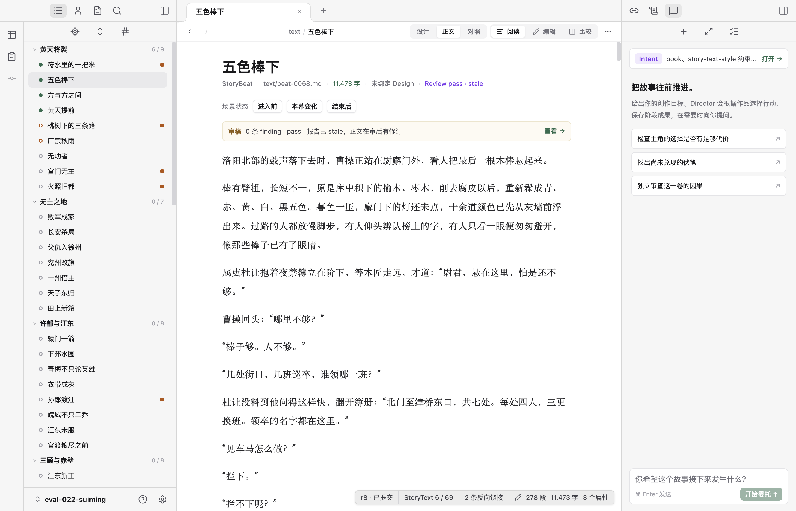
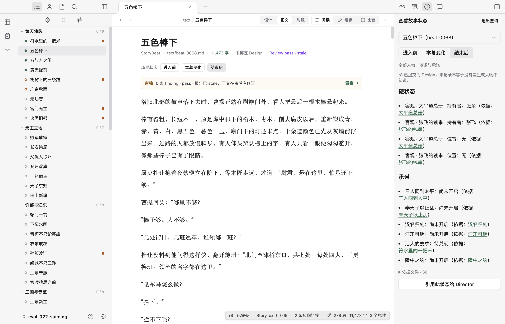

# 状态查询设计反思

用户指出的入口后出现、分割线错位和 Beat 菜单重复均有依据。首轮审查偏重“查询有没有结果、来源是否明确”，没有充分审查新增能力是否融入既有工作台。不能把功能实现正确等同于交互设计成立。

## 本次复核

| 步骤 | 结果 | 判断 |
| --- | --- | --- |
| 1. 退出查询，观察顶部入口 | “故事状态”按钮数量为 0，右侧只有原有三个模式 | 入口取决于操作历史，缺乏稳定性 |
| 2. 点击当前幕“结束后” | 插入“故事状态”按钮，Agent 按钮右移；右栏再次显示同一组三阶段按钮及 Beat 下拉 | 重复控制和布局跳动 |
| 3. 测量分栏标题行 | 既有侧栏行高 37px，状态栏 41px，分割线相差 4px | 未复用工作台的栏头布局规则 |

## 设计判断与建议（尚未实施）

- **能力有价值，不代表每个调用方式都需要一个常驻控件。** 状态查询应成为对象检查的一个查看维度，不应由“进入查询／退出查询”构成另一套操作模式。
- **入口固定。** 在右侧检查栏提供位置稳定的状态入口，未选定位置时解释需要选择什么。删除为了唤出这个入口而散落在正文和人物页的重复按钮；保留有上下文价值的轨迹快捷操作。
- **栏头由共同布局控制。** 共用同一行高、边框和内边距规则，状态面板只负责内容，不再自己定义一套栏头几何结构。
- **当前 Beat 页不需要第二套全书导航。** 以当前幕为查询范围，右栏显示查询位置与边界，去掉默认展开的全书 Beat 下拉。阶段切换仅保留一处。
- **人物／资源页仍需要选择观察位置。** 这是独立用途，不能因为 Beat 页存在冗余就删掉能力；优先从人物轨迹或故事轴选择位置，必要时通过明确的“更换观察位置”操作进入同一选择器。
- **查询范围必须可见。** 打开依据文件时保留原查询位置；引用给 Agent 时保留实际 revision 与边界。减少重复控件不等于重新引入会随任意导航变化的隐式全局时点。

本次只复核截图、DOM 与实现并修正审查判断，未改产品代码。入口动态变化还可能扰动键盘导航顺序；本次未进行完整读屏验收。
