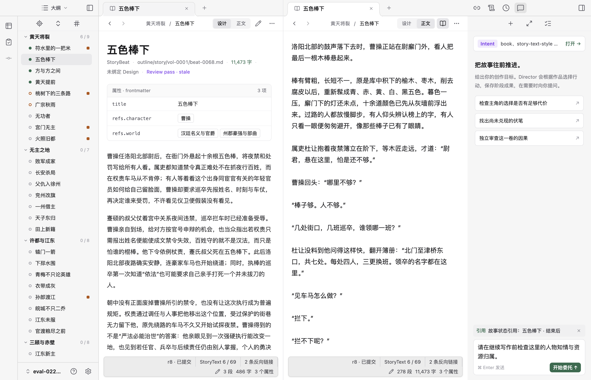
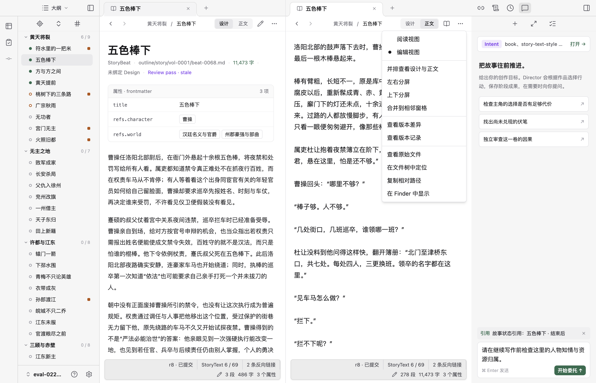
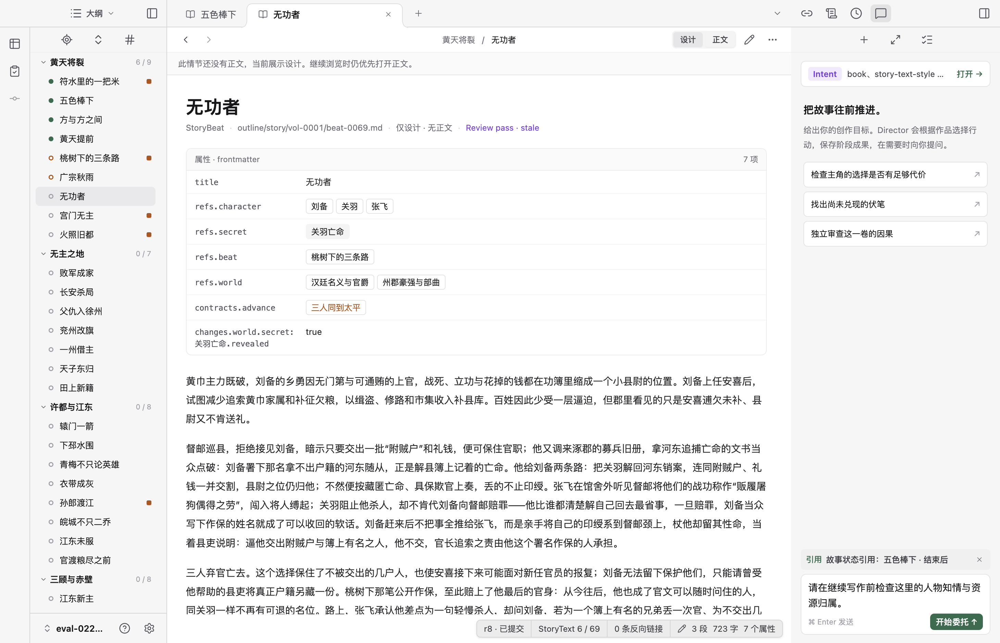

# 内容组织、页面菜单与分屏验收

2026-09-09。落实[已确认方案](../../history/workbench-view-and-menu-proposal.md)，替换此前的专用“并排对照”和文件“源码 / 预览”分段。本轮采用现有 shadcn/ui 控件与 `react-resizable-panels`，没有新增运行状态或作品真源。

## 实际行为

- 大纲首次打开情节默认设计；继续浏览沿用窗格的内容偏好。正文读取完成且正文或共享草稿确为空时，临时显示设计，标题下标注“尚无正文”，下一次仍优先正文。已移除重复的回退横幅及专用提示状态。
- 显式正文请求可进入空正文开始写作；设计搜索结果明确打开设计。历史、已有标签、重载恢复原视图。后台刷新不改变已确定的内容选择。
- 顶部只保留设计 / 正文、一个阅读编辑按钮和更多菜单。编辑时仍能切换设计与正文，草稿分别保留。⌘/Ctrl E 切换阅读与编辑。
- 正文页移除设计属性、文件类型与路径、页末关系图，空正文和分屏中的正文一侧遵循相同规则。设计与对象页面保留关系；源文件通过更多菜单查看，返回对应作品对象仍是该情节的正文。
- 更多菜单按阅读编辑、分屏、版本、文件操作分组。版本记录保留所选文件，没有变更时明确说明，不偷偷显示另一文件；可以选择作品版本。尚未保存的新正文不能打开源文件或定位，菜单说明原因。
- 左右、上下分屏都有独立标签、历史、滚动、内容选择和编辑位置；同文件的视图共享草稿及保存基线。配对命令复用同一套窗格组件，并保留当前编辑状态。
- 合并把标签移到相邻窗格；关闭最后一个有未保存修改的视图沿用保存、放弃、取消流程。空间不足时临时展示活动窗格，放宽恢复原分屏与比例。
- 缺失正文读取修正为返回空内容和空基线，仍拒绝越界与权限错误。新正文通过作品保存命令创建，不误走只支持已有文件的辅助文件入口。

## 真实桌面截图

使用 eval-022 的既有临时副本，未修改作者原始作品，也没有发送 Agent 输入。重启预览后恢复了原有未发送目标和故事状态引用。

### 设计参考与正文编辑

左侧显示“五色棒下”的设计，右侧直接编辑对应正文；两侧工具行、内容选择和底部状态各自完整。截图时未修改正文。

### 分组菜单

菜单显示当前编辑状态，分屏、版本和当前文件操作分组；不重复列出另一份文件的所有动作。

### 正文为空时回到设计

连续阅读进入“无功者”后，显示其已有设计，保留继续阅读正文的偏好。下图记录首次实现；后续按作者反馈移除了横幅，标题状态精简为“尚无正文”，回退与偏好行为不变。

## 自动化与边界

验收命令：

- `node --import tsx --test apps/web/test/*.test.ts`：16 项通过，覆盖打开规则、历史恢复、分屏独立性、共享草稿与保存基线。
- `node --import tsx --test packages/runtime/test/workspace.test.ts`：9 项通过，包含缺失正文、CAS 与文件边界。
- `node --import tsx --test --test-concurrency=1 apps/desktop/test/*.test.ts`：9 项全部通过，覆盖既有 8 条流程及新增分屏完整流程。
- `npm run check:web`、`npm run check:types`、前端及桌面构建、相关文件 Biome、文档链接和 diff 空白检查均通过。

新增桌面流程实际执行：首次设计 → 连续正文 → 空正文回退 → 历史恢复 → 显式空正文 → 配对分屏 → 编辑 → 上下分屏共享草稿 → 分别导航 → 重载 → 合并 → 保存新正文 → 关闭窗格 → 窄窗切换与宽窗恢复 → 指定文件的版本记录。既有回归继续覆盖作者回应、CAS 冲突、版本差异、主进程恢复、导航修复、侧栏调宽与 hover。

编辑仍为 CodeMirror 源码编辑，未实现 Live Preview 或属性局部编辑。没有新的长篇质量或真实 provider 验收；构建仍提示既有大 JS chunk，未把本次 UI 改造扩成打包优化。
