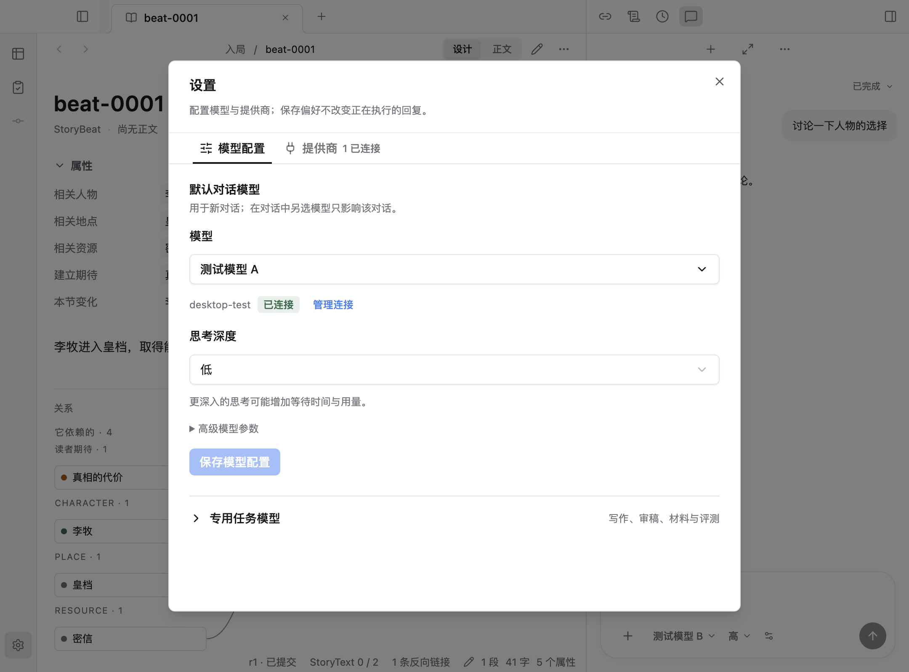

# 蓝色主题调整

按作者提供的蓝色开关参考，将全局主题强调色设为 `#3B82F6`。真源位于 `apps/web/src/style.css`：`--primary`、`--ring`、`--primary-soft`、`--primary-line` 和 `--primary-selection` 分别负责强调色、焦点、浅色背景、描边和编辑器选区。

按钮、链接、欢迎页、版本选择、正文选段和邻域图当前节点使用同一主题。成功、已连接、审稿通过使用独立 `--success`；正文提交状态、人物分类和 diff 红绿语义保留。输入器仍使用已确认的中性色发送按钮。

模型选择与配置的 Electron 流程通过；类型检查、文档链接和桌面前端构建通过。截图为隔离测试作品，已读取设置截图确认蓝色管理链接、保存按钮与绿色连接状态分别显示。

