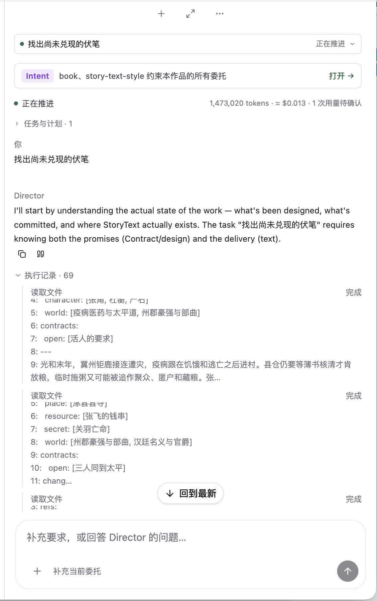
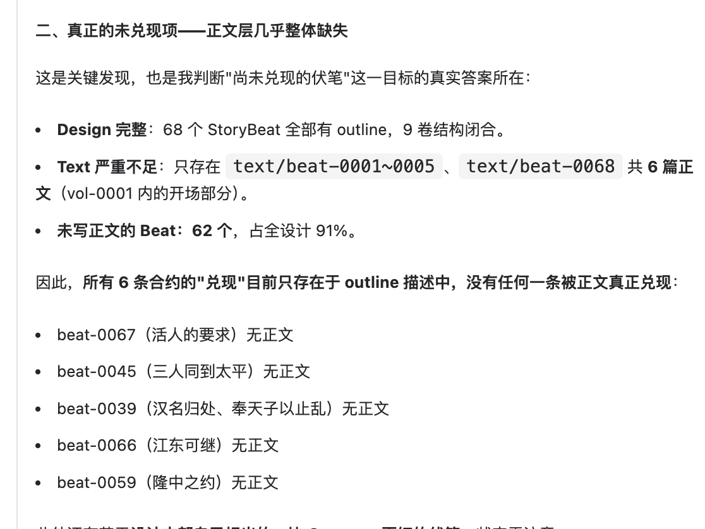

# 对话信息层级与审查语义复核（2026-09-10）

依据：作者本轮提供的两张截图，并核对当前工作台、Agent 指令与 Story Language。此次是截图及代码审查，未操作正在运行的真实委托，也未独立验证报告中的 68 Beat、6 份正文或各条期待的内容结论。

## 1. 执行中：信息优先级混杂

状态：需要改进。委托选择器与独立状态行重复显示「正在推进」；Intent 固定卡、用量、计划、消息角色标签和展开日志挤占对话。69 项执行记录缺少对象名称，文件内容片段比当前判断更显眼。保留复制、引用和回到最新的能力是合理的，但不应让辅助控件成为阅读主线。

源码证据：[AgentPanel](../../../apps/workbench/src/agent-panel.tsx) 分别渲染选择器、Intent 和状态行；[Transcript](../../../apps/workbench/src/agent-transcript.tsx) 展开后直接逐项显示 activity.summary，并因组内任一失败自动展开整组；[loop](../../../packages/runtime/src/harness/loop.ts) 的 summarize 仅截取工具输出前 200 字，不是面向作者的动作摘要。

建议：标题与状态只保留一处；创作约束、用量及执行详情放入明确命名的菜单分组；真实多步计划按需出现，避免把唯一 Agent Task 当作有用计划。连续读取按对象和动作聚合为可展开的一行，二级展示文件名称，三级才查看原始内容；失败突出失败项，不展开全部成功项。作者决策、阶段成果与最终回答优先呈现。对外进度与交付跟随作者语言，术语在必要时保留。

可访问性风险：大量同名「读取文件」难以通过标签区分；灰色长日志与嵌套滚动增加阅读负担。截图不能证明对比度数值、键盘或辅助技术行为，实施后需实测。

## 2. 阅读结论：把实现进度当作设计缺陷

状态：结论的推导不成立。StoryContract 本来位于 outline/contracts；StoryBeat 用 contracts.open / advance / resolve 声明期待的建立、推进与回应。StoryText 基于冻结 Design 另行生成，项目允许只含部分 StoryText。回应 Beat 没有正文，只能表明相应内容尚未实现，不能据此判定设计没有回应伏笔。

依据：[StoryOutline / StoryContract](../../../story-language/outline.md)、[StoryText](../../../story-language/artifacts.md)。resolve 声明和 Checker 通过也不自动证明语义回应充分，仍需读取自然语言因果与结果。

建议分开判断：设计中是否建立并充分回应期待；已生成正文是否实现对应设计；哪些部分尚未生成、无法验证阅读效果。默认「找出尚未兑现的伏笔」应以 Design 为主要依据，在结果中声明范围；明确要求正文审读时才按已有正文及阅读边界评估。StoryContract 只覆盖需要长期追踪的部分期待，不能替代对未结构化伏笔、秘密揭示和因果线索的阅读。

当前 Agent 指令强调权限、提交、冻结与 lineage，但没有明确上述评估边界与对外语言规则；这是需要补足的运行上下文，不能仅靠前端改文案解决。该缺口是代码层发现，并非对本次模型全部错误原因的证明。

本轮仅记录审查与改进方向，未修改产品代码或重写历史对话。
