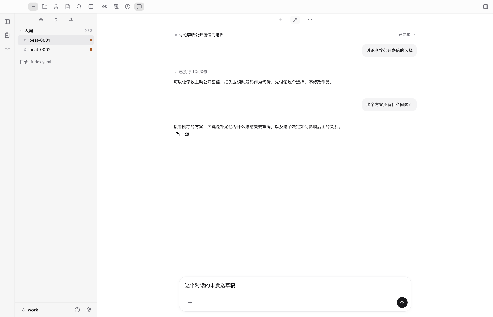
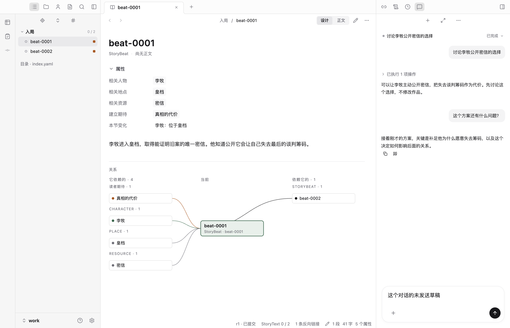

# 连续对话验收 · 2026-09-10

本轮让普通讨论与创作执行共用持续对话。沿用原生组件、TanStack client 与现有 AG-UI，不引入 assistant-ui 依赖或第二执行后端。

## 已验证

- 完成后追问沿用 Conversation，运行中补充仍进入当前 Run；列表按创建时间排列，避免把 ID 排序当成时间顺序。
- 新对话隔离历史与草稿；重载后保留多轮内容、阅读位置和未发送输入。
- 使用持久作者 / Agent 消息作为历史，明确版本和历史状态；32,000 码点初始预算，截取有提示，较早和完整消息可回读。
- 纯讨论不改变作品版本；新增工具后旧 Attempt 仍沿用原工具声明，暂停、未知请求和阶段提交恢复机制通过回归。
- 去除常驻 Intent、重复状态、常驻用量和内部 finish 活动；用户消息采用浅灰背景，AI 回答保留文档排版，活动对象与详情按需展开。
- 输入器保留原有引用、附件、IME、迟到回执和重载规则；输入为空时主按钮停止，有待发送内容时同时提供停止与发送。

测试使用 faux provider 验证协议与状态流，未调用真实模型；不能据此宣称文学判断和长对话语义质量已经验收。初始历史是带截取提示的近期消息，并非自动生成的长期语义摘要。

## 验证结果

- `npm run check` 通过。
- 全量单元测试 292 项：283 通过，9 项依赖外部服务的测试按既有条件跳过。
- 补充的旧 Attempt 工具绑定升级回归与恢复测试共 18 项通过。
- 全量 Electron 桌面测试 14 项通过，覆盖新增连续对话及原有导航、编辑、比较、设置、分栏、提示和恢复流程。

## 桌面截图

