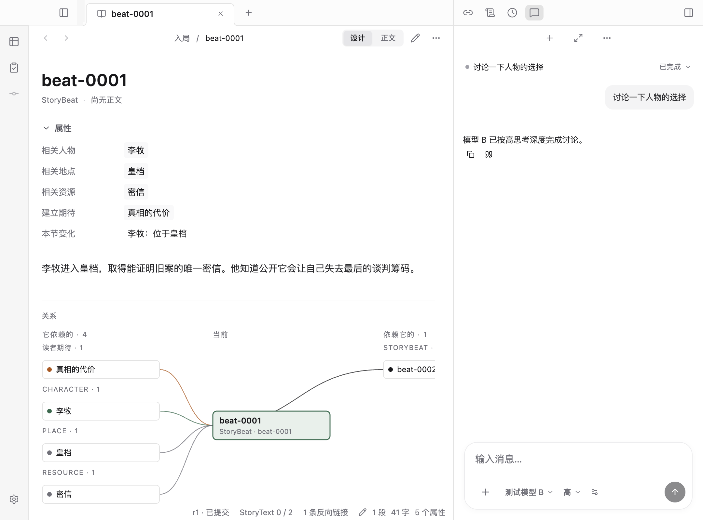
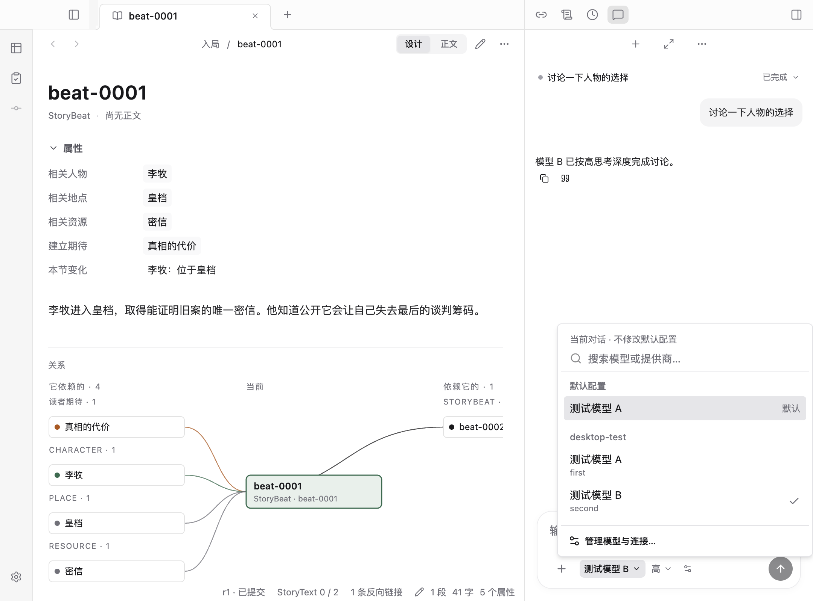
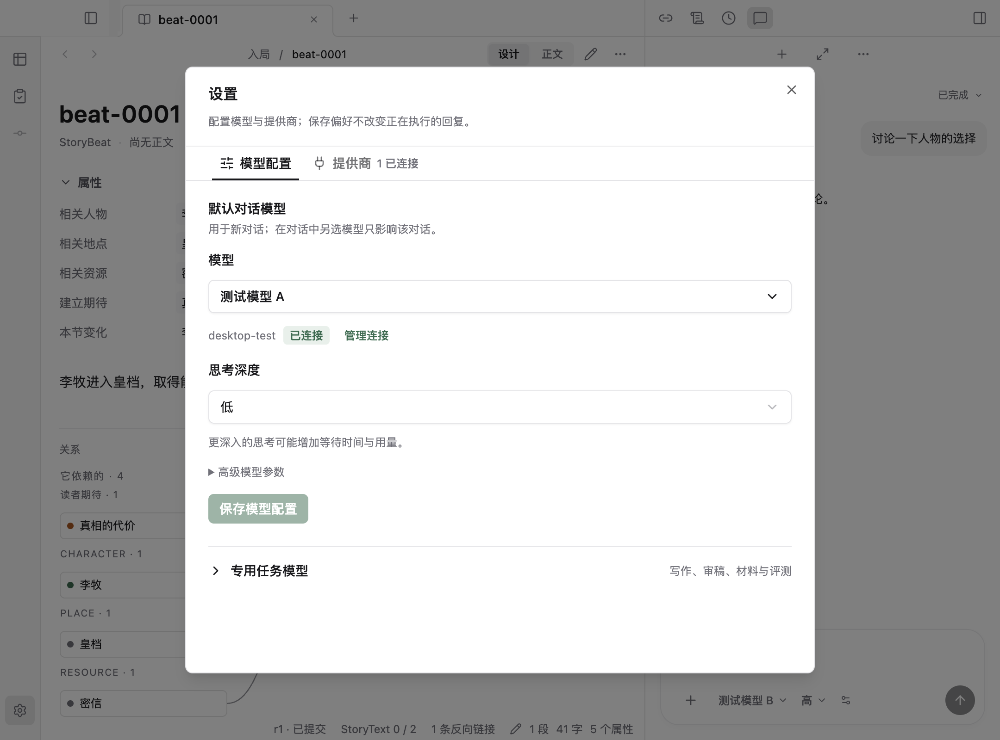
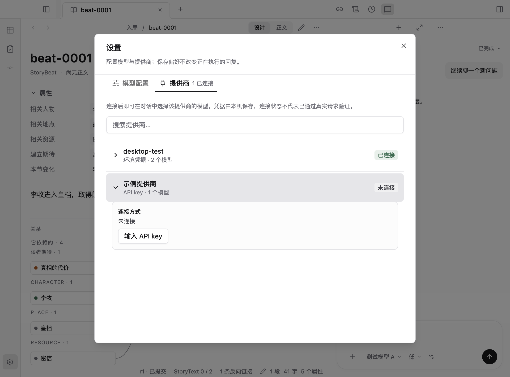
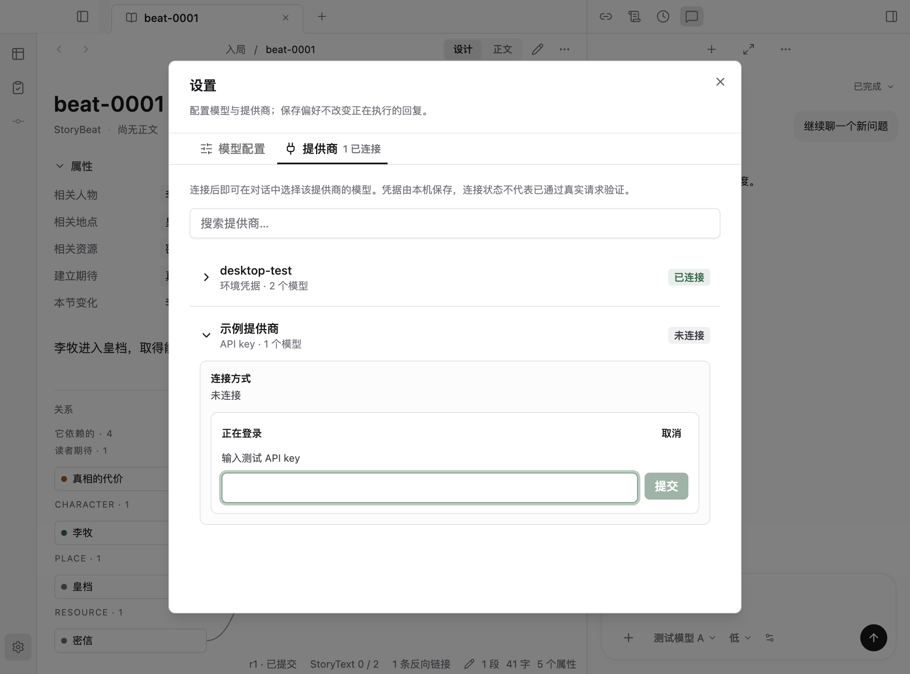

# 模型配置与提供商连接体验验收

2026-09-10，基于现有 Electron 工作台改进。设置与对话共用配置组件及主进程命令，没有新增模型执行路径或凭据存储。截图由本轮桌面测试生成，使用隔离的样例作品和测试模型；1080 × 800 逻辑像素，Retina 截图。认证测试仅使用测试字符串，不调用付费模型。

## 改前问题

本轮先运行原有模型选择测试并读取截图：[原配置面板](before/02-model-settings.png)、[原对话菜单](before/03-model-picker.png)。

- 配置面板将 Provider、模型、角色与登录连接纵向堆叠，连接管理依赖先选择模型；标签语义与表单内容不一致。
- 默认模型显示原始 ID，搜索没有空状态；选中依赖背景色，没有明确选中标记。代码和实际桌面流程确认列表仅由普通按钮组成，缺少方向键搜索选择。
- 1080px 窗口收起目录时，设置按钮随目录消失，对话菜单成为间接入口。

## 最终流程

1. **入口与工作现场：正常。** 导航轨底部固定设置；输入框有模型选择、思考深度和直接配置按钮。窄栏不溢出，配置关闭后保留未发送消息与原对话。

   

2. **对话选择模型：正常。** 菜单声明当前对话作用域，默认模型显示名称，按提供商分组。搜索支持名称和 ID，方向键与 Enter 可选择；对勾表示当前模型。无连接、无匹配、加载和失败有对应反馈。

   

3. **模型偏好：正常。** 默认模型在首屏，思考深度依模型能力显示，高级参数和专用任务折叠。修改后显示未保存、保存或还原；JSON 错误就地反馈。切换标签保留草稿，保存默认配置不改变当前对话绑定。

   

4. **提供商管理：正常。** 独立搜索、已连接优先、连接方式与模型数量可见；展开提供商后操作账号或 API key。模型表单中的管理连接可直达对应提供商。删除前明确范围，可取消删除；环境凭据不受删除影响。

   

5. **登录与恢复：测试流程正常，真实 OAuth 待验收。** 密钥输入隐藏，错误保留原因并可重新登录，提交期间阻止重复操作；关闭设置会取消仍在等待的登录。截图是在输入任何测试密钥前截取。

   

## 验证范围

- `npm run check`：通过（仓库另有一条不影响退出码的既有风格提示）。
- Electron 全量回归：15 条中的 14 条首轮通过；旧设置测试定位旧标题失败。更新为搜索、分组选择、独立连接页的新路径后，该设置用例单独重跑通过。
- 扩展的 `model-picker.test.ts`：通过，覆盖两个直接入口、菜单入口、搜索无结果、键盘选择、默认与单对话隔离、重载、草稿、JSON 校验、登录失败重试、删除确认及关闭后的主进程会话取消。
- `local-model-settings.test.ts` 与 `conversation-model.test.ts`：5 项通过，包含 API key 与模拟 OAuth、思考映射、冻结绑定和凭据不回读。
- 桌面构建通过；保留已有 bundle 体积提示。

截图已逐张读取，确认没有截断表单、半透明动画残帧或错误窗口。视觉状态使用文字与选中对勾辅助颜色；命名、焦点控件和搜索键盘选择经过实际测试。这不代表完整的屏幕阅读器或 WCAG 合规审计。真实 OAuth 登录、刷新及实际付费请求未在本轮验证。
