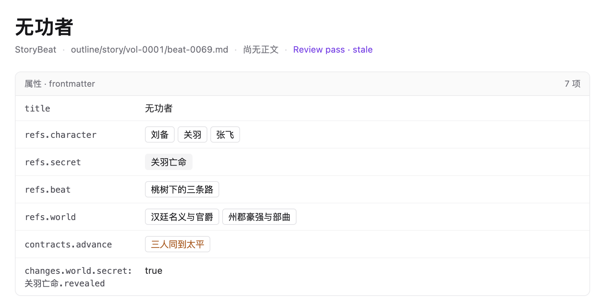

# 属性信息呈现审查

2026-09-10。范围仅为作者提供的两张属性区截图，并结合当前渲染实现与 Story Language 核对语义。审查后的实现与验收记录见文末。截图由作者提供，不代表本轮操作过 Obsidian。

## 1. Suiming：引用可读，字段与容器偏重

已将多个人物及情节解析为可读标题，并提供作品跳转，这是应保留的能力。主要问题：

- 外框、灰色表头、逐行分割线以及每个值的边框叠加，属性区过于醒目。
- `title` 与页面标题重复；`frontmatter` 和技术性的「7 项」对作者帮助有限。
- 左列使用等宽英文键；嵌套状态被展开成 `changes.world.secret:关羽亡命.revealed`，被迫换行并增加理解成本。
- 值 `true` 没有表达本节造成的故事变化；默认视图应保留作用域并给出确定性中文表达。
- 引用呈现为按钮，承诺单独着色，非文件秘密又像不能点击的按钮，交互外观不够一致。

源码依据：[Props](../../../apps/web/src/pages.tsx) 将所有属性统一渲染成行；审查时的 `propRows` 递归扁平化对象并将标量转为字符串；已替换为 [propertyRows](../../../apps/web/src/artifact-properties.ts)。问题既有样式因素，也有信息表达因素。

## 2. Obsidian：布局较轻，复杂值仍需解读

无外框的两列布局、弱化属性名和自然留白适合参考。该截图中的 `subjects` 仍展示 JSON，`deadline` 仍是 Beat ID；Suiming 可以依靠领域信息提供更可读的内容，无需复制这些表达。

## 建议

采用可折叠的轻量「属性」区，默认展开；移除大外框、灰表头和每行横线。属性名使用与正文一致的字体和弱化颜色，标签列约 100–120px，值列弹性伸缩。单行保持紧凑，多值和长内容自然换行；窄分屏必要时上下排列。

截图中的内容建议如下：

| 展示名称 | 内容 |
| --- | --- |
| 相关人物 | 刘备、关羽、张飞 |
| 相关秘密 | 关羽亡命 |
| 依赖情节 | 桃树下的三条路 |
| 世界设定 | 汉廷名义与官爵、州郡豪强与部曲 |
| 推进期待 | 三人同到太平 |
| 本节变化 | 秘密「关羽亡命」在故事世界中公开 |

标题只在页首呈现。已知字段按领域规则展示中文名称；未知字段保留可查看的原键和值，不丢失信息，也不通过模型临时编造解释。原始字段继续可在「源文件」中查看，不新增全局模式。

语义约束来自 [StoryBeat](../../../story-language/outline.md) 和[硬状态作用域](../../../story-language/state.md)：

- `refs.character` 不等于出场人物；不能据此推断人物在场。
- `refs.secret` 不对应文件；不提供虚假的打开文件行为。
- `changes.world` 的秘密公开不等于所有人物已知；`reader` 与具体 `character` 的获知要分别表达。
- `changes` 表达本节结束时新成立的结果，不是全书当前状态快照；未记录不等于 false。

可跳转引用使用一致的中性色文字和圆角灰色悬停/聚焦反馈，避免每个值都有按钮边框；不依赖颜色单独表达类型。非文件值保持普通文字或静态标签。引用跳转与属性编辑应有明确独立的操作入口，阅读态不把布尔值伪装成可操作开关。

标题下辅助信息可进一步弱化：作者视图降低文件路径的优先级，保留「源文件」入口；`Review pass · stale` 可表达为「历史审稿通过 · 待复核」，不暗示当前内容已经通过审稿。

## 验证边界

审查阶段核对截图和源码；实现验收见下。屏幕阅读器兼容性尚未单独测试，需持续检查长中文值换行、键值配对语义、链接键盘可达及焦点可见、非交互值无按钮误导。移除边框后仍应保持充分的对比度及点击范围，不能只靠 hover 才能识别操作。

## 落实与验收

- 保留原数据与源文件入口，属性不再重复标题；中性色引用可跳转，秘密为静态文字。
- 世界公开、读者获知与人物获知分别表达；开场状态与本节变化分组，缺省不补值，未知字段和空值完整保留。
- 「读者期待」「建立期待」「推进期待」「回应期待」已同步到导航、故事轴、属性、进展条与提示；StoryContract、作品文件和协议字段未更名。
- 12 项属性与故事轴测试通过，覆盖中文标题跳转、秘密作用域、名字含点、缺省状态、未知字段、空集合和期限。
- 类型检查、Vite 构建、3 项 Electron 流程通过；属性支持鼠标折叠与键盘展开，源文件往返、正文无属性表及关系图、引用跳转继续有效。

960px 窗口左右分屏时，属性区实际宽度约 251.5px，转为标签在上、值在下。两侧共 12 个值区域均无横向溢出；正文与工具栏保留各自的滚动和导航行为。
