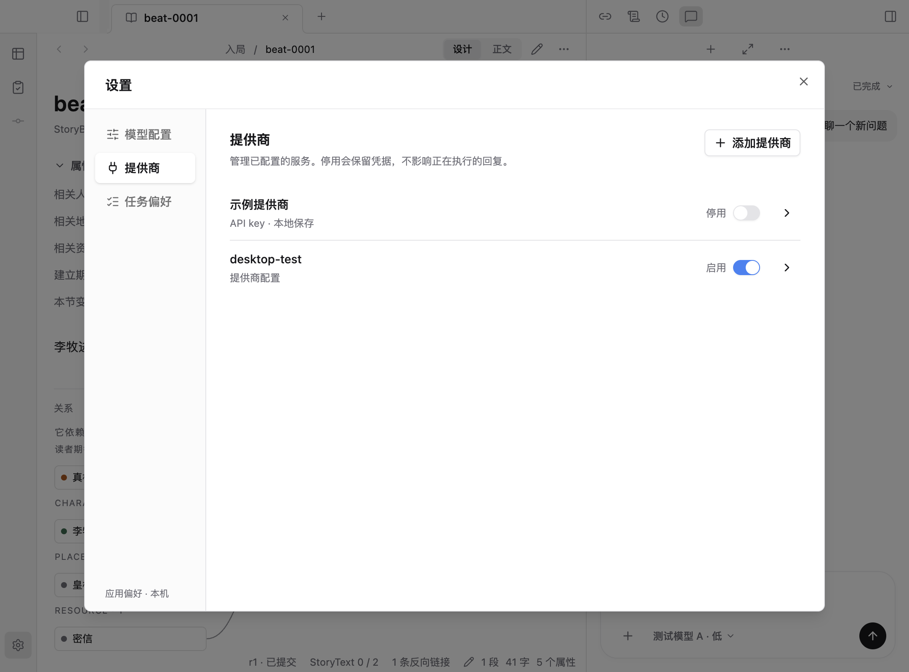
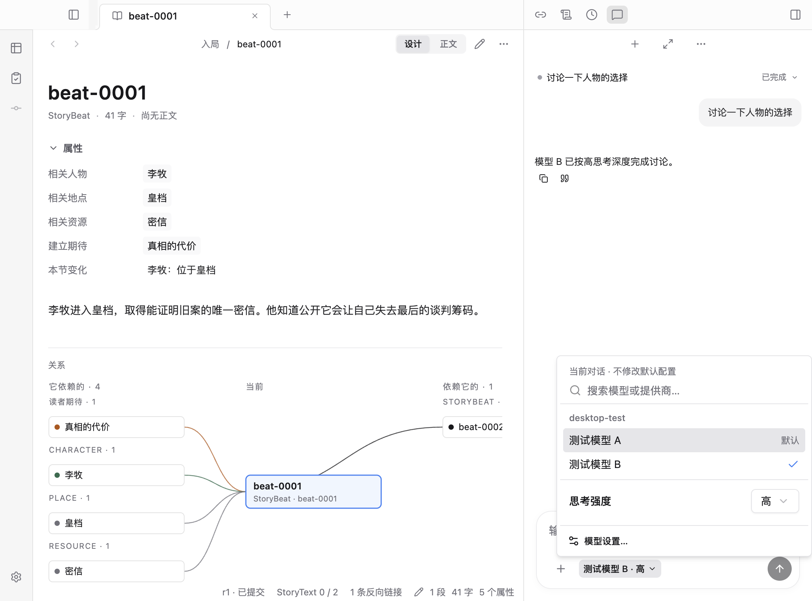

# 提供商启用管理与模型选择验收

2026-09-11。提供商与模型继续分开组织；本次收敛已配置列表、独立启用开关和同一面板内的模型 / 思考强度选择。

## 交互与边界

1. 提供商首页只显示已配置服务、被 profile 引用但缺凭据的服务和已停用服务；完整目录通过「添加提供商」进入。每行只保留名称、认证状态、开关和管理入口。
2. 停用写入本机 config.toml，保留凭据和 profile；模型选择器移除其模型，Runtime 拒绝新绑定。重新启用不要求重填凭据。详情中的删除本地凭据是独立操作。
3. 新启动与显式换绑使用新偏好，已有 Attempt 的冻结绑定继续可恢复。原回复终态发布后的清理窗口由 controller 等待完成，避免紧接着操作时出现虚假的活动冲突。
4. 对话和设置共用模型目录及强度控件。选择模型后面板保持打开，兼容强度保留，不兼容时回到模型默认；无思考强度能力时隐藏控件。默认模型在原条目旁标记，不再重复列出。
5. 认证状态只表明凭据可解析，不表示真实网络请求已验证成功。

## 界面

以下为真实 Electron 渲染截图，使用隔离的合成提供商和作品；不包含真实凭据，不是线上 OAuth 验收。

## 验证

- Runtime 定向 29 项通过：包含关闭 / 重开配置、环境与本地凭据保留、默认 / 显式新绑定拦截、冻结绑定恢复、运行中修改偏好。
- Electron 两条完整流程通过：模型设置与连续对话，含真实 IPC 开关、目录过滤、启动拦截、认证失败重试、兼容强度、无思考能力模型、窄栏与草稿保留。
- 构建、类型、格式及工程检查通过。Vite 保留既有 chunk 大小提示。
- 全量回归首次发现错误码分类遗漏，已修复；并发重跑受到磁盘 ENOSPC 影响。最终以并发 2 复验全部 322 项：313 通过、9 项外部环境测试跳过、0 失败。
- 未调用真实付费模型，未更改用户的提供商配置或凭据；真实 OAuth 登录 / 刷新继续保留原验收边界。
