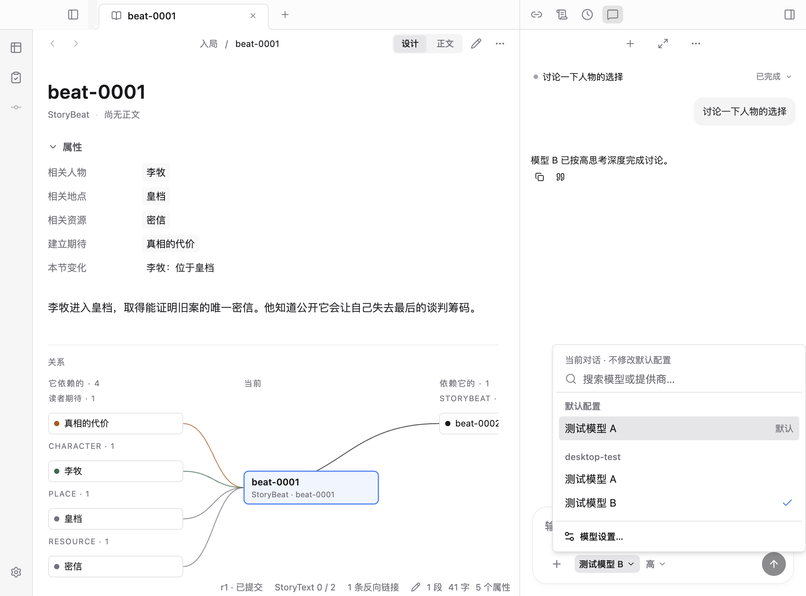
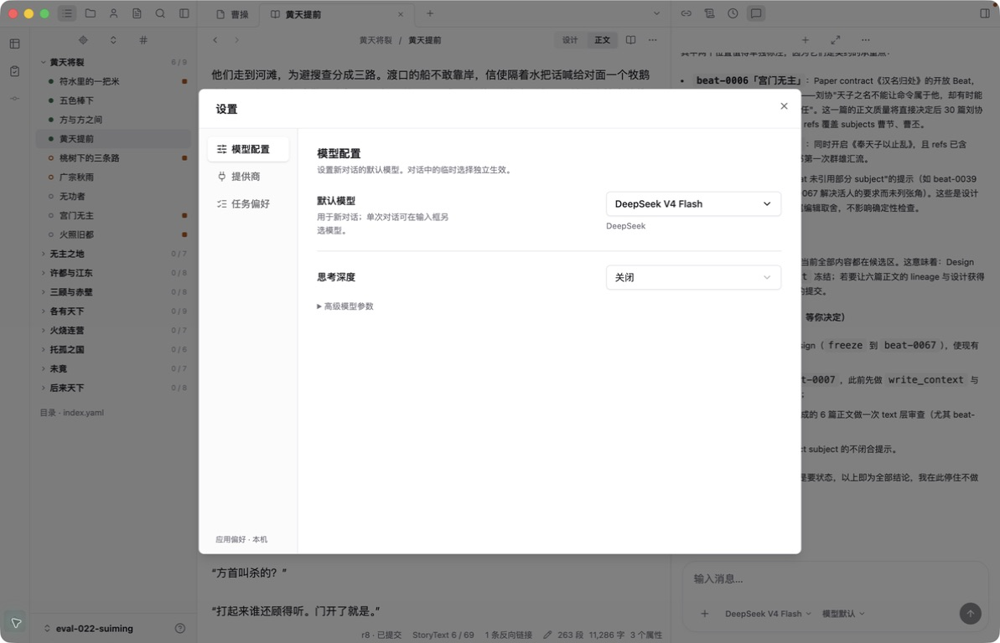
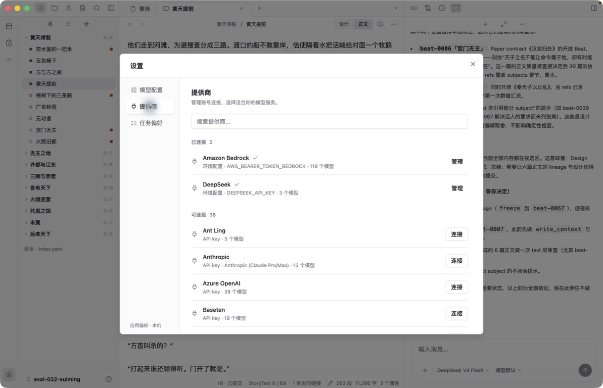
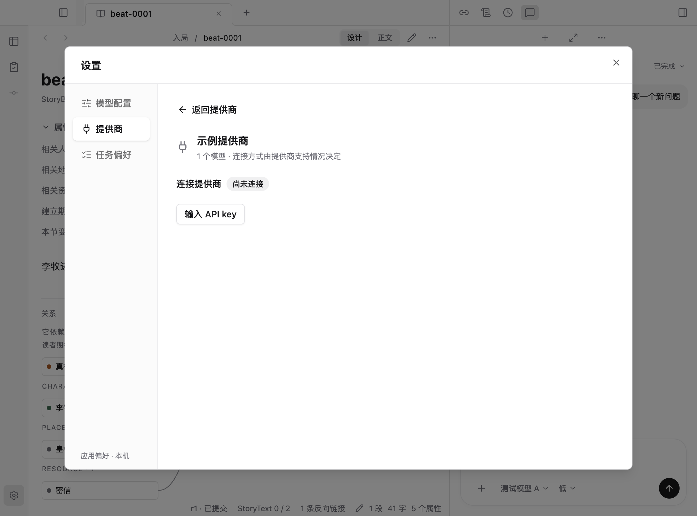
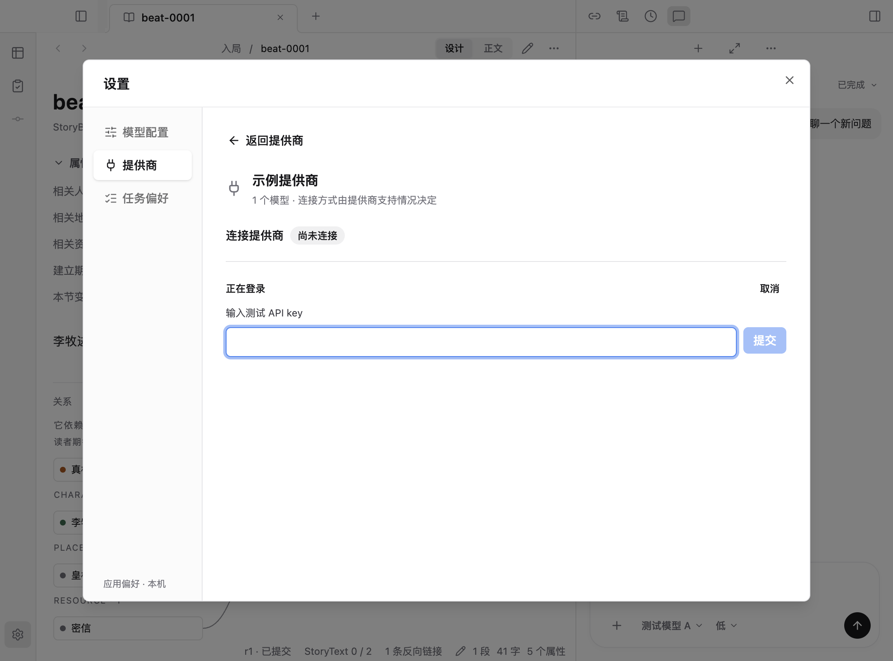
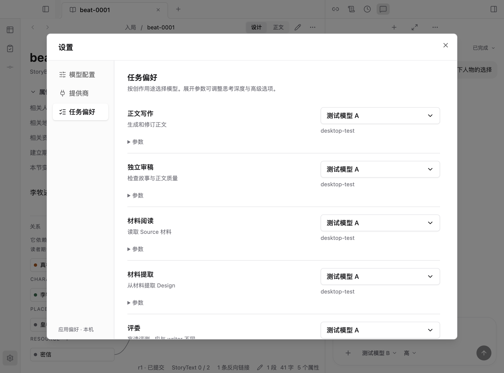

# 设置、模型入口与配色审查（2026-09-11）

审查覆盖首屏、全局设置、对话模型菜单、默认模型、任务偏好、提供商列表、连接与失败恢复。按 Product Design audit 的截图与路径检查方式，结合当前源码梳理入口；使用现有 Electron 回归捕获隔离样例，再以原生窗口核验真实配置。没有新增设置系统或配置存储。

## 发现与统一规则

| 问题 | 原因 | 本轮收敛 |
| --- | --- | --- |
| 首屏大片蓝色 | 装饰性径向渐变引用主题选择色 | 删除渐变，标志改中性灰；蓝色保留必要主动作、焦点及小面积选择反馈 |
| 同一对话出现多个配置入口 | 模型菜单、独立配置图标、失败提示都打开同一设置 | 只保留模型菜单中的「模型设置…」；全局导航轨仍有「设置」 |
| 默认模型页重复提供商入口 | 设置分类、连接摘要卡、每个模型的管理链接叠加 | 提供商分类是唯一连接管理入口，模型行只提供名称和必要状态说明 |
| 模型与连接的职责混杂 | 旧版六用途表重复展示提供商与可用标签 | 分为模型配置、提供商、任务偏好；使用紧凑设置行，高级参数按需展开 |
| 配置状态依然绿色 | 通用成功标签被用于连接配置 | 配置不再使用绿色标签，已连接采用蓝色对勾与中性文字 |
| 构建完成却仍显示旧界面 | Electron 打开的 renderer 不随静态构建刷新 | 检查当前草稿和工作状态后，通过 View → Reload 重载，核对真实窗口 |

页面之间共用一个配置面板、一份模型目录和原有主进程配置服务。日常对话选择只影响该对话，保存设置只改变后续默认绑定；连接不自动选择默认模型。

## 路径与截图

### 1. 首屏：配色已收敛

白底、中性标志，打开作品保留一个蓝色主动作。计算样式的 `backgroundImage` 为 `none`。本图使用全新隔离用户目录；底部「请先打开或创建作品」来自现有空工作区错误提示，仍是可改进的空态文案，本轮未扩大到工作区加载协议。

### 2. 对话模型菜单：入口已去重

输入器保留模型与思考深度，配置只在模型菜单末尾出现。菜单使用灰色条目背景与蓝色当前选择对勾。搜索无结果、键盘选取、选择恢复与新对话默认行为通过回归。

### 3. 默认模型设置：职责已明确

模型与思考深度以设置行显示，提供商是辅助文字。没有连接摘要卡或管理链接。高级参数默认折叠，只有更改后出现保存 / 还原；切换分类保留草稿。以下为刷新后的真实 Electron 窗口，默认模型仍是 DeepSeek V4 Flash。

### 4. 提供商列表：连接管理集中

先列已连接，再列可连接；支持搜索，单行只有一个管理 / 连接动作。实际目录为 2 个已连接、38 个可连接，长列表在右侧内容区滚动。这里的已连接表示本机存在可用凭据来源，不等于本轮已发送网络请求验证所有服务。

### 5. 提供商连接：流程回归通过，真实 OAuth 未验收

点击单个提供商进入同一内容区的连接页，保留返回与分类导航。隔离测试检查了密码输入、失败重试、取消、删除确认；未使用真实账号进行登录或修改凭据。

### 6. 任务偏好：独立配置，长内容滚动

五类任务使用同一模型编辑器，各自保存；不再重复可用标签与管理连接入口。下方任务通过滚动访问，展开参数不挤压其他设置分类。

## 验证与边界

- 前端 TypeScript 检查、Vite 构建、相关文件 Biome 检查通过。
- 模型选择与设置 Electron 回归通过：当前对话选择、思考深度、刷新恢复、全局默认、搜索 / 键盘、JSON 校验、切换分类保留草稿、连接失败 / 重试 / 删除 / 取消。
- 内置提供商 Electron 回归通过：DeepSeek 配置保存、凭据状态经主进程更新、凭据不回读到 renderer、断开与重新打开设置。
- 原生窗口已通过 View → Reload 加载本次构建，确认三个分类、无独立对话配置按钮、无模型页管理链接、蓝色连接对勾；真实模型配置与作品版本未修改。
- 可见焦点、控件名称、键盘选择与 Esc 关闭经过检查；没有据此宣称完整读屏或 WCAG 合规。
- Vite 仍有现有的大 chunk 提示；本轮不调整打包架构。

当前界面以[作者工作台设计](../../web-product-design.md)为准，前几轮截图仅作为历史记录。
